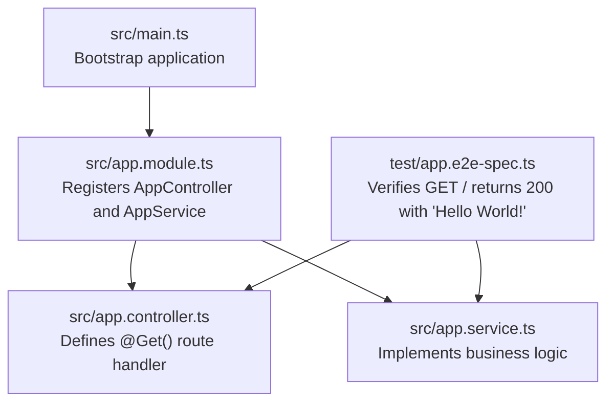
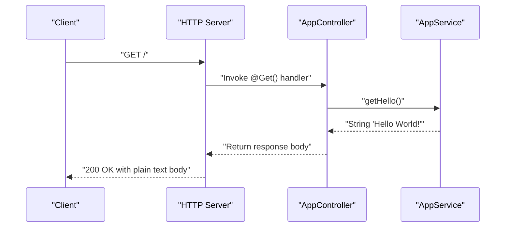
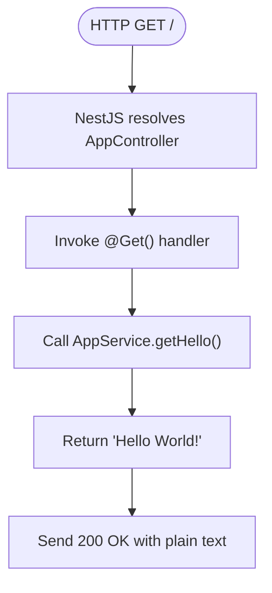
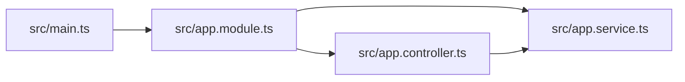

# API Endpoints Reference

<cite>
**Referenced Files in This Document**
- [src/main.ts](file://src/main.ts)
- [src/app.module.ts](file://src/app.module.ts)
- [src/app.controller.ts](file://src/app.controller.ts)
- [src/app.service.ts](file://src/app.service.ts)
- [test/app.e2e-spec.ts](file://test/app.e2e-spec.ts)
</cite>

## Table of Contents
1. [Introduction](#introduction)
2. [Project Structure](#project-structure)
3. [Core Components](#core-components)
4. [Architecture Overview](#architecture-overview)
5. [Detailed Component Analysis](#detailed-component-analysis)
6. [Dependency Analysis](#dependency-analysis)
7. [Performance Considerations](#performance-considerations)
8. [Troubleshooting Guide](#troubleshooting-guide)
9. [Conclusion](#conclusion)
10. [Appendices](#appendices)

## Introduction
This document provides API documentation for the root GET / endpoint in the easysearch-monolith application. The endpoint is a simple RESTful HTTP GET request that returns a plain text response “Hello World!” with a 200 OK status. No request parameters, headers, or authentication are required. The endpoint serves as a health check and development verification mechanism.

## Project Structure
The application follows a minimal NestJS structure with a single controller and service. The module registers the controller and provider, while the main entry point initializes the NestJS application and starts the HTTP server.

**Diagram sources**
- [src/main.ts](file://src/main.ts#L1-L9)
- [src/app.module.ts](file://src/app.module.ts#L1-L13)
- [src/app.controller.ts](file://src/app.controller.ts#L1-L13)
- [src/app.service.ts](file://src/app.service.ts#L1-L9)
- [test/app.e2e-spec.ts](file://test/app.e2e-spec.ts#L1-L25)

**Section sources**
- [src/main.ts](file://src/main.ts#L1-L9)
- [src/app.module.ts](file://src/app.module.ts#L1-L13)

## Core Components
- AppController: Declares the root route using the @Get() decorator and delegates to AppService.getHello().
- AppService: Provides the business logic that returns the plain text “Hello World!”.
- AppModule: Registers the controller and provider so NestJS can resolve dependencies.
- main.ts: Bootstraps the application and starts the HTTP server on the configured port.

Key implementation references:
- Controller route definition: [src/app.controller.ts](file://src/app.controller.ts#L1-L13)
- Service method: [src/app.service.ts](file://src/app.service.ts#L1-L9)
- Module registration: [src/app.module.ts](file://src/app.module.ts#L1-L13)
- Application bootstrap: [src/main.ts](file://src/main.ts#L1-L9)

**Section sources**
- [src/app.controller.ts](file://src/app.controller.ts#L1-L13)
- [src/app.service.ts](file://src/app.service.ts#L1-L9)
- [src/app.module.ts](file://src/app.module.ts#L1-L13)
- [src/main.ts](file://src/main.ts#L1-L9)

## Architecture Overview
The request lifecycle for GET / is straightforward: the HTTP server receives the request, NestJS resolves the controller and service, executes the route handler, and returns the response.

**Diagram sources**
- [src/app.controller.ts](file://src/app.controller.ts#L1-L13)
- [src/app.service.ts](file://src/app.service.ts#L1-L9)
- [src/main.ts](file://src/main.ts#L1-L9)

## Detailed Component Analysis

### Root GET / Endpoint
- Method: GET
- Path: /
- Authentication: Not required
- Request body: None
- Response: 200 OK with a plain text body containing “Hello World!”

Behavior verification:
- The endpoint is validated by an end-to-end test that asserts a 200 status and the expected response body.

Implementation references:
- Route handler: [src/app.controller.ts](file://src/app.controller.ts#L1-L13)
- Business logic: [src/app.service.ts](file://src/app.service.ts#L1-L9)
- Test assertion: [test/app.e2e-spec.ts](file://test/app.e2e-spec.ts#L1-L25)

**Diagram sources**
- [src/app.controller.ts](file://src/app.controller.ts#L1-L13)
- [src/app.service.ts](file://src/app.service.ts#L1-L9)
- [test/app.e2e-spec.ts](file://test/app.e2e-spec.ts#L1-L25)

**Section sources**
- [src/app.controller.ts](file://src/app.controller.ts#L1-L13)
- [src/app.service.ts](file://src/app.service.ts#L1-L9)
- [test/app.e2e-spec.ts](file://test/app.e2e-spec.ts#L1-L25)

### How the Route Is Mapped
- AppController is decorated as a controller without a base path, so its route handlers are mounted at the root path.
- The @Get() decorator on the getHello method maps to GET requests at the root path.
- The handler delegates to AppService.getHello(), which returns the plain text payload.

References:
- Controller declaration and route: [src/app.controller.ts](file://src/app.controller.ts#L1-L13)
- Service method: [src/app.service.ts](file://src/app.service.ts#L1-L9)
- Module registration: [src/app.module.ts](file://src/app.module.ts#L1-L13)

**Section sources**
- [src/app.controller.ts](file://src/app.controller.ts#L1-L13)
- [src/app.module.ts](file://src/app.module.ts#L1-L13)

### Client Usage Examples
- Using curl:
  - curl -i http://localhost:3000/
- Using JavaScript fetch:
  - fetch("http://localhost:3000/").then(response => console.log(response.status, response.text()));

Notes:
- The application listens on the configured port (default 3000).
- No special headers or authentication are required.

References:
- Port configuration and server startup: [src/main.ts](file://src/main.ts#L1-L9)

**Section sources**
- [src/main.ts](file://src/main.ts#L1-L9)

### Error Handling
- Current behavior: There is no explicit error handling for the root endpoint. If an unhandled error occurs during request processing, NestJS will propagate it according to its default error handling behavior.
- Suggested enhancements:
  - Add centralized exception filtering to standardize error responses.
  - Introduce guards or interceptors for logging and metrics.
  - Consider adding response formatting middleware for consistent headers and content types.

[No sources needed since this section provides general guidance]

## Dependency Analysis
The application’s runtime dependency chain for GET / is minimal and focused.

**Diagram sources**
- [src/main.ts](file://src/main.ts#L1-L9)
- [src/app.module.ts](file://src/app.module.ts#L1-L13)
- [src/app.controller.ts](file://src/app.controller.ts#L1-L13)
- [src/app.service.ts](file://src/app.service.ts#L1-L9)

**Section sources**
- [src/app.module.ts](file://src/app.module.ts#L1-L13)
- [src/app.controller.ts](file://src/app.controller.ts#L1-L13)
- [src/app.service.ts](file://src/app.service.ts#L1-L9)

## Performance Considerations
- The endpoint is trivial and lightweight; performance impact is negligible.
- For production deployments, consider:
  - Enabling compression for static or small responses.
  - Adding rate limiting at the gateway or reverse proxy level.
  - Implementing health checks that leverage this endpoint for monitoring.

[No sources needed since this section provides general guidance]

## Troubleshooting Guide
- If the endpoint returns an unexpected status:
  - Verify the server is running and listening on the expected port.
  - Confirm the application module registers the controller and provider.
- If the response body is not “Hello World!”:
  - Check that the service method returns the expected string.
  - Ensure the controller handler calls the service method.

References:
- Server bootstrap and port: [src/main.ts](file://src/main.ts#L1-L9)
- Module registration: [src/app.module.ts](file://src/app.module.ts#L1-L13)
- Service method: [src/app.service.ts](file://src/app.service.ts#L1-L9)
- Controller handler: [src/app.controller.ts](file://src/app.controller.ts#L1-L13)

**Section sources**
- [src/main.ts](file://src/main.ts#L1-L9)
- [src/app.module.ts](file://src/app.module.ts#L1-L13)
- [src/app.service.ts](file://src/app.service.ts#L1-L9)
- [src/app.controller.ts](file://src/app.controller.ts#L1-L13)

## Conclusion
The root GET / endpoint is intentionally simple, returning a plain text “Hello World!” with a 200 OK status. It is implemented using the controller-service pattern and validated by an end-to-end test. As the application evolves, you can extend this pattern to add new endpoints, introduce standardized error handling, and incorporate monitoring and rate limiting.

[No sources needed since this section summarizes without analyzing specific files]

## Appendices

### Adding Additional Endpoints Following the Controller-Service Pattern
- Create a new controller with a dedicated route decorator (e.g., @Get("/resource"), @Post("/resource")).
- Implement handler methods that delegate to a service.
- Register the new controller in the module’s controllers array.
- Add a corresponding provider/service if needed and register it in the module’s providers array.

References:
- Controller pattern: [src/app.controller.ts](file://src/app.controller.ts#L1-L13)
- Service pattern: [src/app.service.ts](file://src/app.service.ts#L1-L9)
- Module registration: [src/app.module.ts](file://src/app.module.ts#L1-L13)

**Section sources**
- [src/app.controller.ts](file://src/app.controller.ts#L1-L13)
- [src/app.service.ts](file://src/app.service.ts#L1-L9)
- [src/app.module.ts](file://src/app.module.ts#L1-L13)