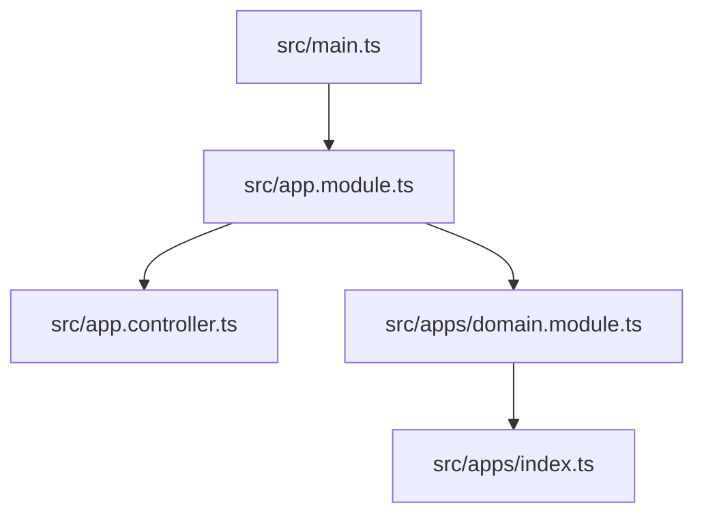
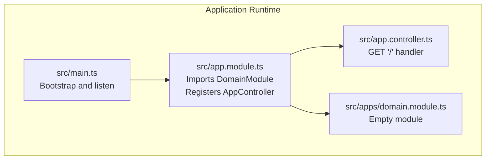
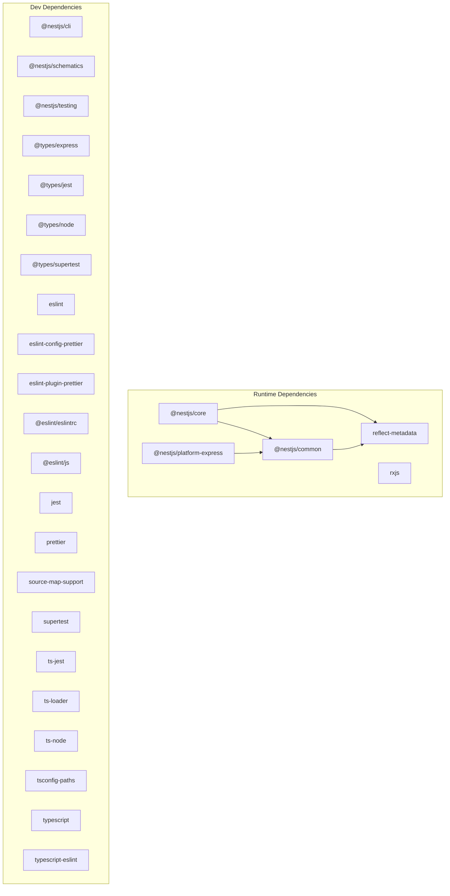

# Development Setup Guide

<cite>
**Referenced Files in This Document**
- [package.json](file://package.json)
- [README.md](file://README.md)
- [src/main.ts](file://src/main.ts)
- [src/app.module.ts](file://src/app.module.ts)
- [src/app.controller.ts](file://src/app.controller.ts)
- [src/apps/domain.module.ts](file://src/apps/domain.module.ts)
- [src/apps/index.ts](file://src/apps/index.ts)
- [eslint.config.mjs](file://eslint.config.mjs)
- [.prettierrc](file://.prettierrc)
- [nest-cli.json](file://nest-cli.json)
- [test/jest-e2e.json](file://test/jest-e2e.json)
</cite>

## Table of Contents
1. [Introduction](#introduction)
2. [Project Structure](#project-structure)
3. [Core Components](#core-components)
4. [Architecture Overview](#architecture-overview)
5. [Detailed Component Analysis](#detailed-component-analysis)
6. [Dependency Analysis](#dependency-analysis)
7. [Performance Considerations](#performance-considerations)
8. [Troubleshooting Guide](#troubleshooting-guide)
9. [Conclusion](#conclusion)
10. [Appendices](#appendices)

## Introduction
This guide walks you through setting up and running the easysearch-monolith project locally. It covers cloning the repository, installing dependencies using pnpm, starting the development server, understanding available scripts, configuring environment variables, verifying the setup, and troubleshooting common issues. It also outlines recommended development tools and workflows for formatting and linting.

## Project Structure
The project follows a typical NestJS monorepo-like layout with a single application module and a minimal domain module. The entry point initializes the Nest application and listens on a configurable port.

**Diagram sources**
- [src/main.ts](file://src/main.ts#L1-L9)
- [src/app.module.ts](file://src/app.module.ts#L1-L13)
- [src/app.controller.ts](file://src/app.controller.ts#L1-L13)
- [src/apps/domain.module.ts](file://src/apps/domain.module.ts#L1-L11)
- [src/apps/index.ts](file://src/apps/index.ts#L1-L1)

**Section sources**
- [src/main.ts](file://src/main.ts#L1-L9)
- [src/app.module.ts](file://src/app.module.ts#L1-L13)
- [src/app.controller.ts](file://src/app.controller.ts#L1-L13)
- [src/apps/domain.module.ts](file://src/apps/domain.module.ts#L1-L11)
- [src/apps/index.ts](file://src/apps/index.ts#L1-L1)

## Core Components
- Application bootstrap: Initializes the Nest application and starts listening on a configured port.
- Root controller: Exposes a GET endpoint at the root path.
- Domain module: A placeholder module that can be extended later.

Key runtime behavior:
- Port configuration defaults to 3000 if the PORT environment variable is not set.

**Section sources**
- [src/main.ts](file://src/main.ts#L1-L9)
- [src/app.controller.ts](file://src/app.controller.ts#L1-L13)
- [src/apps/domain.module.ts](file://src/apps/domain.module.ts#L1-L11)

## Architecture Overview
The runtime architecture is a minimal NestJS application with a single controller and module. The bootstrap function creates the application and binds it to the configured port.

**Diagram sources**
- [src/main.ts](file://src/main.ts#L1-L9)
- [src/app.module.ts](file://src/app.module.ts#L1-L13)
- [src/app.controller.ts](file://src/app.controller.ts#L1-L13)
- [src/apps/domain.module.ts](file://src/apps/domain.module.ts#L1-L11)

## Detailed Component Analysis

### Environment Configuration and Port Behavior
- The application listens on the port specified by the PORT environment variable. If not set, it defaults to 3000.
- To change the port, export or set the PORT environment variable before starting the server.

Verification tip:
- Access the root endpoint at http://localhost:3000 to confirm the server is running.

**Section sources**
- [src/main.ts](file://src/main.ts#L1-L9)

### Available Scripts
The project defines a comprehensive set of scripts for development, building, testing, linting, and formatting. These are executed via pnpm.

- Build the project for production:
  - Command: nest build
  - Purpose: Compiles TypeScript sources into JavaScript artifacts under the build output directory.

- Start in production mode:
  - Command: node dist/main
  - Purpose: Runs the compiled application.

- Start in development mode with hot reload:
  - Command: nest start --watch
  - Purpose: Starts the application in watch mode for rapid iteration during development.

- Start in debug mode with hot reload:
  - Command: nest start --debug --watch
  - Purpose: Starts the application in debug mode with watch enabled for easier debugging sessions.

- Linting:
  - Command: eslint "{src,apps,libs,test}/**/*.ts" --fix
  - Purpose: Runs ESLint on TypeScript sources and applies automatic fixes where possible.

- Formatting:
  - Command: prettier --write "src/**/*.ts" "test/**/*.ts"
  - Purpose: Formats TypeScript files according to the configured Prettier rules.

- Testing:
  - Unit tests: jest
  - Watch mode: jest --watch
  - Coverage: jest --coverage
  - Debug mode: node --inspect-brk -r tsconfig-paths/register -r ts-node/register node_modules/.bin/jest --runInBand
  - End-to-end tests: jest --config ./test/jest-e2e.json

These scripts are defined in the project’s package.json and can be invoked using pnpm run <script-name>.

**Section sources**
- [package.json](file://package.json#L1-L72)
- [test/jest-e2e.json](file://test/jest-e2e.json#L1-L10)

### Development Workflow: Formatting and Linting
- Formatting: Prettier is configured via .prettierrc to enforce consistent code style.
- Linting: ESLint is configured via eslint.config.mjs with TypeScript ESLint recommended rules and Prettier integration.

Recommended commands:
- Format all TypeScript files: pnpm run format
- Fix lint issues automatically: pnpm run lint

**Section sources**
- [.prettierrc](file://.prettierrc#L1-L5)
- [eslint.config.mjs](file://eslint.config.mjs#L1-L36)
- [package.json](file://package.json#L1-L72)

### Nest CLI and Compiler Options
- The Nest CLI configuration specifies the source root and compiler options, including deleting the output directory after compilation.

**Section sources**
- [nest-cli.json](file://nest-cli.json#L1-L9)

## Dependency Analysis
The project relies on NestJS core packages and a set of development dependencies for TypeScript, Jest, ESLint, and Prettier. The dependency tree is intentionally minimal to keep the monolith lightweight.

**Diagram sources**
- [package.json](file://package.json#L1-L72)

**Section sources**
- [package.json](file://package.json#L1-L72)

## Performance Considerations
- Use development mode with watch enabled for rapid feedback during local development.
- Prefer incremental builds and hot reload to reduce restart overhead.
- Keep the domain module minimal until additional features are introduced to avoid unnecessary complexity.

[No sources needed since this section provides general guidance]

## Troubleshooting Guide

Common issues and resolutions:

- Missing pnpm
  - Symptom: Command not found when running pnpm install or pnpm run ...
  - Resolution: Install pnpm globally or use your preferred package manager. After installation, retry the commands.

- Port conflicts
  - Symptom: Error indicating the port is already in use.
  - Resolution: Change the PORT environment variable to a free port before starting the server.

- Compilation errors
  - Symptom: Errors during build or start:dev.
  - Resolution: Review TypeScript errors reported by the compiler. Ensure all dependencies are installed and the TypeScript configuration is valid.

- Linting or formatting failures
  - Symptom: ESLint or Prettier reports errors.
  - Resolution: Run the lint and format scripts to apply fixes and reformat files.

- Jest test failures
  - Symptom: Test suite fails or coverage not generated.
  - Resolution: Inspect test configuration and ensure unit and e2e test files match the expected patterns.

Verification step:
- Confirm the server is running by accessing the root endpoint at http://localhost:3000.

**Section sources**
- [src/main.ts](file://src/main.ts#L1-L9)
- [package.json](file://package.json#L1-L72)
- [test/jest-e2e.json](file://test/jest-e2e.json#L1-L10)

## Conclusion
You now have the essential steps to clone, install, run, and verify the easysearch-monolith project locally. Use the provided scripts for development, testing, linting, and formatting. Configure the PORT environment variable as needed and leverage the recommended tools to streamline your workflow.

[No sources needed since this section summarizes without analyzing specific files]

## Appendices

### Step-by-Step Setup Instructions
1. Clone the repository to your local machine.
2. Install dependencies using pnpm install.
3. Start the development server with pnpm run start:dev.
4. Verify the setup by visiting http://localhost:3000.

Optional verification:
- Run unit tests with pnpm run test.
- Run e2e tests with pnpm run test:e2e.
- Apply formatting with pnpm run format.
- Apply lint fixes with pnpm run lint.

**Section sources**
- [README.md](file://README.md#L24-L60)
- [package.json](file://package.json#L1-L72)
- [src/main.ts](file://src/main.ts#L1-L9)

### Recommended Development Tools
- IDE: Visual Studio Code with TypeScript support.
- Extensions: NestJS snippets for convenient scaffolding.
- REST client: Use a REST client extension or tool to test endpoints locally.

[No sources needed since this section provides general guidance]