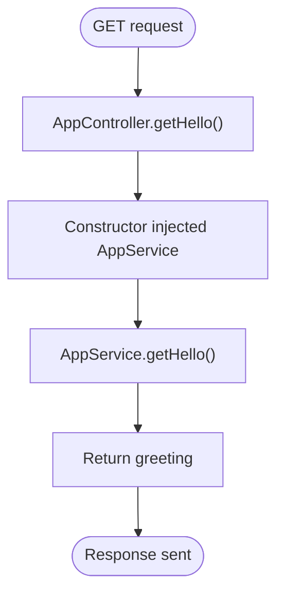

# AppModule Architecture

<cite>
**Referenced Files in This Document**
- [src/app.module.ts](file://src/app.module.ts)
- [src/main.ts](file://src/main.ts)
- [src/app.controller.ts](file://src/app.controller.ts)
- [src/app.service.ts](file://src/app.service.ts)
- [src/apps/domain.module.ts](file://src/apps/domain.module.ts)
- [src/apps/index.ts](file://src/apps/index.ts)
- [package.json](file://package.json)
</cite>

## Table of Contents
1. [Introduction](#introduction)
2. [Project Structure](#project-structure)
3. [Core Components](#core-components)
4. [Architecture Overview](#architecture-overview)
5. [Detailed Component Analysis](#detailed-component-analysis)
6. [Dependency Analysis](#dependency-analysis)
7. [Performance Considerations](#performance-considerations)
8. [Troubleshooting Guide](#troubleshooting-guide)
9. [Conclusion](#conclusion)

## Introduction
This document explains the architecture of the AppModule in the easysearch-monolith project. The AppModule serves as the root module responsible for bootstrapping the application. It declares the application’s dependency graph by importing the DomainModule, registering the AppController, and providing the AppService. The document also describes how main.ts initializes the NestJS application using NestFactory and how the controller depends on the service through dependency injection.

## Project Structure
The project follows a minimal NestJS monolith layout:
- Root module: AppModule
- Entry point: main.ts
- Application controller and service: AppController and AppService
- Domain module: DomainModule (currently empty, exported via apps/index.ts)

**Diagram sources**
- [src/main.ts](file://src/main.ts#L1-L9)
- [src/app.module.ts](file://src/app.module.ts#L1-L13)
- [src/apps/domain.module.ts](file://src/apps/domain.module.ts#L1-L11)
- [src/apps/index.ts](file://src/apps/index.ts#L1-L1)
- [src/app.controller.ts](file://src/app.controller.ts#L1-L13)
- [src/app.service.ts](file://src/app.service.ts#L1-L9)

**Section sources**
- [src/main.ts](file://src/main.ts#L1-L9)
- [src/app.module.ts](file://src/app.module.ts#L1-L13)
- [src/apps/domain.module.ts](file://src/apps/domain.module.ts#L1-L11)
- [src/apps/index.ts](file://src/apps/index.ts#L1-L1)
- [src/app.controller.ts](file://src/app.controller.ts#L1-L13)
- [src/app.service.ts](file://src/app.service.ts#L1-L9)

## Core Components
- AppModule: Declares imports, controllers, and providers arrays. It imports DomainModule and registers AppController and AppService.
- DomainModule: An empty module exported via apps/index.ts. It currently has no imports, controllers, providers, or exports.
- AppController: A controller with a GET endpoint that delegates to AppService.
- AppService: A simple injectable service that returns a greeting message.
- main.ts: Bootstraps the application using NestFactory and listens on the configured port.

Key responsibilities:
- AppModule orchestrates the dependency graph and wires together modules and components.
- AppController depends on AppService via constructor injection.
- DomainModule acts as a placeholder for future domain-related modules and exports.

**Section sources**
- [src/app.module.ts](file://src/app.module.ts#L1-L13)
- [src/apps/domain.module.ts](file://src/apps/domain.module.ts#L1-L11)
- [src/apps/index.ts](file://src/apps/index.ts#L1-L1)
- [src/app.controller.ts](file://src/app.controller.ts#L1-L13)
- [src/app.service.ts](file://src/app.service.ts#L1-L9)
- [src/main.ts](file://src/main.ts#L1-L9)

## Architecture Overview
The AppModule is the root module that NestJS uses to construct the application’s dependency graph. It imports DomainModule, registers AppController, and provides AppService. At runtime, main.ts creates the NestJS application instance using AppModule and starts the server.

**Diagram sources**
- [src/main.ts](file://src/main.ts#L1-L9)
- [src/app.module.ts](file://src/app.module.ts#L1-L13)
- [src/apps/domain.module.ts](file://src/apps/domain.module.ts#L1-L11)
- [src/app.controller.ts](file://src/app.controller.ts#L1-L13)
- [src/app.service.ts](file://src/app.service.ts#L1-L9)

## Detailed Component Analysis

### AppModule Analysis
- Purpose: Root module that defines the application’s dependency graph.
- Imports array: Contains DomainModule, enabling the root module to depend on domain-level capabilities.
- Controllers array: Registers AppController, exposing HTTP endpoints.
- Providers array: Declares AppService, making it available for dependency injection.

**Diagram sources**
- [src/app.module.ts](file://src/app.module.ts#L1-L13)
- [src/apps/domain.module.ts](file://src/apps/domain.module.ts#L1-L11)
- [src/app.controller.ts](file://src/app.controller.ts#L1-L13)
- [src/app.service.ts](file://src/app.service.ts#L1-L9)

**Section sources**
- [src/app.module.ts](file://src/app.module.ts#L1-L13)

### DomainModule Analysis
- Purpose: Placeholder module exported via apps/index.ts.
- Current state: No imports, controllers, providers, or exports.
- Future role: Intended to host domain-specific modules and services.

**Section sources**
- [src/apps/domain.module.ts](file://src/apps/domain.module.ts#L1-L11)
- [src/apps/index.ts](file://src/apps/index.ts#L1-L1)

### AppController Analysis
- Purpose: Exposes a GET endpoint that returns a greeting.
- Dependency: Uses AppService via constructor injection.
- Behavior: Delegates to AppService.getHello().

**Diagram sources**
- [src/app.controller.ts](file://src/app.controller.ts#L1-L13)
- [src/app.service.ts](file://src/app.service.ts#L1-L9)

**Section sources**
- [src/app.controller.ts](file://src/app.controller.ts#L1-L13)
- [src/app.service.ts](file://src/app.service.ts#L1-L9)

### AppService Analysis
- Purpose: Provides business logic for the application.
- Decorator: Injectable, enabling dependency injection.
- Method: Returns a greeting string.

**Section sources**
- [src/app.service.ts](file://src/app.service.ts#L1-L9)

### main.ts Analysis
- Purpose: Bootstraps the NestJS application.
- Process: Creates the application using AppModule and starts listening on the configured port.

**Section sources**
- [src/main.ts](file://src/main.ts#L1-L9)

## Dependency Analysis
The dependency relationships are straightforward:
- main.ts depends on AppModule.
- AppModule depends on DomainModule, AppController, and AppService.
- AppController depends on AppService.
- apps/index.ts re-exports DomainModule for convenient imports.

**Diagram sources**
- [src/main.ts](file://src/main.ts#L1-L9)
- [src/app.module.ts](file://src/app.module.ts#L1-L13)
- [src/apps/domain.module.ts](file://src/apps/domain.module.ts#L1-L11)
- [src/apps/index.ts](file://src/apps/index.ts#L1-L1)
- [src/app.controller.ts](file://src/app.controller.ts#L1-L13)
- [src/app.service.ts](file://src/app.service.ts#L1-L9)

**Section sources**
- [src/main.ts](file://src/main.ts#L1-L9)
- [src/app.module.ts](file://src/app.module.ts#L1-L13)
- [src/apps/domain.module.ts](file://src/apps/domain.module.ts#L1-L11)
- [src/apps/index.ts](file://src/apps/index.ts#L1-L1)
- [src/app.controller.ts](file://src/app.controller.ts#L1-L13)
- [src/app.service.ts](file://src/app.service.ts#L1-L9)

## Performance Considerations
- Keep AppModule minimal: Only register essential modules, controllers, and providers here.
- Avoid heavy initialization in AppModule; defer to lazy-loaded modules or services.
- Use DomainModule as a boundary for domain concerns to improve modularity and testability.
- Ensure providers are scoped appropriately (default singleton) unless otherwise required.

[No sources needed since this section provides general guidance]

## Troubleshooting Guide
Common issues and resolutions:
- Nest can’t resolve dependencies
  - Cause: Missing provider or circular dependency.
  - Resolution: Verify the provider is declared in a module that is imported by AppModule. Check for circular imports among modules and services.
  - Reference: [src/app.module.ts](file://src/app.module.ts#L1-L13)
- Missing provider error
  - Cause: Provider not registered or module not imported.
  - Resolution: Add the provider to providers array or ensure the module exporting it is included in imports.
  - Reference: [src/app.module.ts](file://src/app.module.ts#L1-L13)
- Circular dependencies
  - Cause: Two modules depend on each other directly or indirectly.
  - Resolution: Refactor shared logic into a separate module and import it from both sides; avoid direct cross-imports.
  - Reference: [src/app.module.ts](file://src/app.module.ts#L1-L13), [src/apps/domain.module.ts](file://src/apps/domain.module.ts#L1-L11)
- Controller not receiving injected service
  - Cause: Service not marked as Injectable or not provided in the same or parent module.
  - Resolution: Ensure the service is decorated as Injectable and is provided in a reachable module.
  - Reference: [src/app.service.ts](file://src/app.service.ts#L1-L9), [src/app.controller.ts](file://src/app.controller.ts#L1-L13)

**Section sources**
- [src/app.module.ts](file://src/app.module.ts#L1-L13)
- [src/apps/domain.module.ts](file://src/apps/domain.module.ts#L1-L11)
- [src/app.service.ts](file://src/app.service.ts#L1-L9)
- [src/app.controller.ts](file://src/app.controller.ts#L1-L13)

## Best Practices for Root Modules
- Keep AppModule small and focused on composition.
- Use DomainModule as a container for domain boundaries.
- Avoid importing heavy third-party modules directly in AppModule; prefer feature modules.
- Centralize global providers in shared modules rather than in AppModule.
- Prevent circular dependencies by organizing modules with clear ownership and boundaries.
- Export only what is necessary from apps/index.ts to reduce coupling.

[No sources needed since this section provides general guidance]

## Conclusion
The AppModule is the root of the easysearch-monolith application. It imports DomainModule, registers AppController, and provides AppService, establishing the dependency graph. main.ts creates the application instance using AppModule and starts the server. Following best practices ensures maintainability, scalability, and fewer dependency-related issues.

[No sources needed since this section summarizes without analyzing specific files]