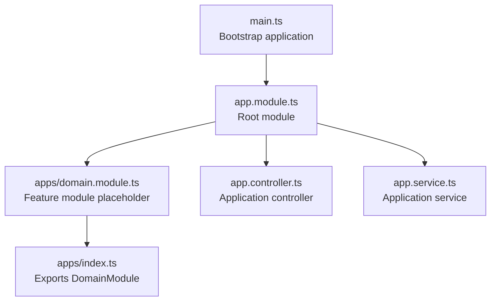
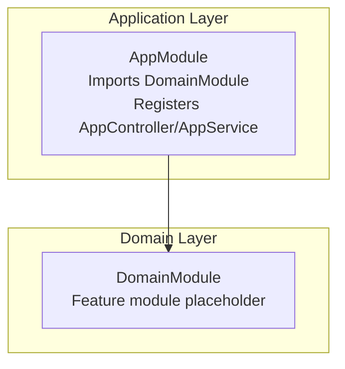
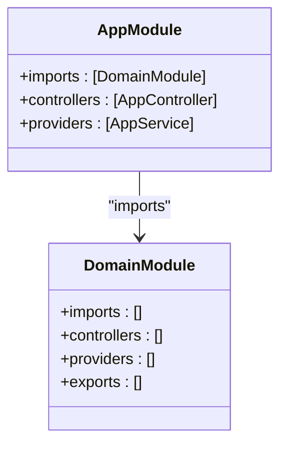
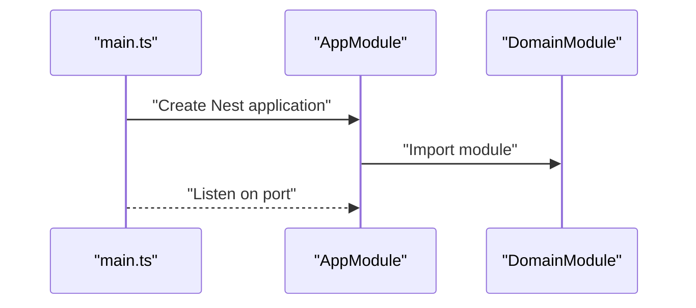
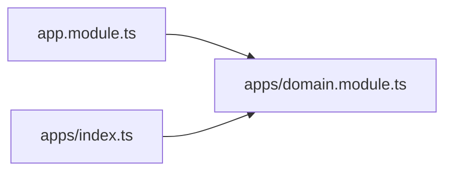

# DomainModule Structure

<cite>
**Referenced Files in This Document**
- [domain.module.ts](file://src/apps/domain.module.ts)
- [index.ts](file://src/apps/index.ts)
- [app.module.ts](file://src/app.module.ts)
- [main.ts](file://src/main.ts)
- [app.controller.ts](file://src/app.controller.ts)
- [app.service.ts](file://src/app.service.ts)
</cite>

## Table of Contents
1. [Introduction](#introduction)
2. [Project Structure](#project-structure)
3. [Core Components](#core-components)
4. [Architecture Overview](#architecture-overview)
5. [Detailed Component Analysis](#detailed-component-analysis)
6. [Dependency Analysis](#dependency-analysis)
7. [Performance Considerations](#performance-considerations)
8. [Troubleshooting Guide](#troubleshooting-guide)
9. [Conclusion](#conclusion)
10. [Appendices](#appendices)

## Introduction
This document explains the DomainModule as a feature module placeholder intended for future search-related functionality. The module currently has an empty configuration with empty arrays for imports, controllers, providers, and exports. This intentionally minimal structure serves as a clean foundation for encapsulating cohesive business logic related to search operations. Feature modules in NestJS are used to group related functionality into cohesive units, enabling clear separation of concerns between application configuration (AppModule) and domain-specific features (DomainModule).

## Project Structure
The project follows a layered structure:
- Application bootstrap is handled by main.ts, which creates the Nest application and registers AppModule.
- AppModule is the root module that imports DomainModule and registers the application-level controller and service.
- DomainModule is a feature module placeholder located under src/apps and exported via src/apps/index.ts.
- The application’s default controller and service reside in the root src directory.

**Diagram sources**
- [main.ts](file://src/main.ts#L1-L9)
- [app.module.ts](file://src/app.module.ts#L1-L13)
- [domain.module.ts](file://src/apps/domain.module.ts#L1-L11)
- [index.ts](file://src/apps/index.ts#L1-L1)
- [app.controller.ts](file://src/app.controller.ts#L1-L13)
- [app.service.ts](file://src/app.service.ts#L1-L9)

**Section sources**
- [main.ts](file://src/main.ts#L1-L9)
- [app.module.ts](file://src/app.module.ts#L1-L13)
- [domain.module.ts](file://src/apps/domain.module.ts#L1-L11)
- [index.ts](file://src/apps/index.ts#L1-L1)
- [app.controller.ts](file://src/app.controller.ts#L1-L13)
- [app.service.ts](file://src/app.service.ts#L1-L9)

## Core Components
- DomainModule: A feature module placeholder with an empty configuration. It imports nothing, defines no controllers, provides no services, and exports nothing. This design enables future search-related features to be added without affecting the root application module.
- DomainModule index: Re-exports DomainModule so consumers can import it directly from the apps directory.
- AppModule: The root module that imports DomainModule and registers the application-level controller and service.
- Application controller and service: Basic demonstration of NestJS controllers and services.

Key characteristics of DomainModule:
- Minimal footprint to avoid unnecessary coupling.
- Ready to accept search-related controllers, services, and repositories.
- Export list can be expanded to expose domain capabilities to other modules.

**Section sources**
- [domain.module.ts](file://src/apps/domain.module.ts#L1-L11)
- [index.ts](file://src/apps/index.ts#L1-L1)
- [app.module.ts](file://src/app.module.ts#L1-L13)
- [app.controller.ts](file://src/app.controller.ts#L1-L13)
- [app.service.ts](file://src/app.service.ts#L1-L9)

## Architecture Overview
DomainModule is intentionally decoupled from the application-level concerns. AppModule orchestrates the application lifecycle and delegates domain-specific features to DomainModule. This separation ensures that:
- AppModule remains focused on application configuration and cross-cutting concerns.
- DomainModule encapsulates search-related features, keeping them cohesive and testable.

**Diagram sources**
- [app.module.ts](file://src/app.module.ts#L1-L13)
- [domain.module.ts](file://src/apps/domain.module.ts#L1-L11)

## Detailed Component Analysis

### DomainModule Analysis
DomainModule is a feature module placeholder with an intentionally empty configuration. Its current shape:
- imports: empty array
- controllers: empty array
- providers: empty array
- exports: empty array

This design:
- Prevents accidental coupling to unrelated modules.
- Provides a clean namespace for search-related features.
- Allows controlled exposure of domain capabilities via the exports array.

Extending DomainModule:
- Add controllers for search endpoints.
- Add services for search logic and orchestration.
- Add repositories for persistence of search indices or related data.
- Export services/repositories to enable consumption by other modules.

**Diagram sources**
- [domain.module.ts](file://src/apps/domain.module.ts#L1-L11)
- [app.module.ts](file://src/app.module.ts#L1-L13)

**Section sources**
- [domain.module.ts](file://src/apps/domain.module.ts#L1-L11)
- [app.module.ts](file://src/app.module.ts#L1-L13)

### AppModule and DomainModule Relationship
- AppModule imports DomainModule, establishing a parent-child relationship.
- AppModule registers the application-level controller and service.
- DomainModule remains empty, ready to host search features.

**Diagram sources**
- [main.ts](file://src/main.ts#L1-L9)
- [app.module.ts](file://src/app.module.ts#L1-L13)
- [domain.module.ts](file://src/apps/domain.module.ts#L1-L11)

**Section sources**
- [main.ts](file://src/main.ts#L1-L9)
- [app.module.ts](file://src/app.module.ts#L1-L13)
- [domain.module.ts](file://src/apps/domain.module.ts#L1-L11)

### Extension Patterns and Migration Strategies
Recommended patterns for evolving DomainModule:
- Add controllers for search endpoints and integrate with services.
- Introduce services for query processing, result ranking, and indexing orchestration.
- Add repositories for persistence of search indices or metadata.
- Export services/repositories to enable consumption by other modules.
- Use NestJS dependency injection to wire components and manage lifecycles.

Migration strategies:
- Start with minimal controllers/services and gradually add complexity.
- Keep search logic encapsulated within DomainModule to maintain cohesion.
- Use exports to expose only necessary capabilities to other modules.
- Maintain separation between application configuration (AppModule) and domain features (DomainModule).

[No sources needed since this section provides general guidance]

## Dependency Analysis
DomainModule currently has no internal dependencies. AppModule depends on DomainModule, while DomainModule remains independent. The index.ts file re-exports DomainModule for convenient imports.

**Diagram sources**
- [app.module.ts](file://src/app.module.ts#L1-L13)
- [domain.module.ts](file://src/apps/domain.module.ts#L1-L11)
- [index.ts](file://src/apps/index.ts#L1-L1)

**Section sources**
- [app.module.ts](file://src/app.module.ts#L1-L13)
- [domain.module.ts](file://src/apps/domain.module.ts#L1-L11)
- [index.ts](file://src/apps/index.ts#L1-L1)

## Performance Considerations
- Keep DomainModule lightweight initially to minimize bootstrapping overhead.
- Add search-related services and repositories incrementally to avoid heavy initialization during startup.
- Use lazy loading patterns for heavy dependencies if search features become complex.
- Monitor memory usage and optimize data structures for search operations as the module grows.

[No sources needed since this section provides general guidance]

## Troubleshooting Guide
Common issues and resolutions:
- Import path errors: Ensure DomainModule is imported from the apps directory and re-exported via index.ts.
- Missing exports: If other modules depend on DomainModule capabilities, add them to the exports array.
- Conflicting controllers/services: Verify that DomainModule does not unintentionally conflict with AppModule-level controllers/services.
- Port binding: Confirm the application listens on the expected port as configured in main.ts.

**Section sources**
- [main.ts](file://src/main.ts#L1-L9)
- [app.module.ts](file://src/app.module.ts#L1-L13)
- [domain.module.ts](file://src/apps/domain.module.ts#L1-L11)
- [index.ts](file://src/apps/index.ts#L1-L1)

## Conclusion
DomainModule serves as a deliberate placeholder for future search-related functionality. Its empty configuration ensures a clean foundation for encapsulating cohesive business logic while maintaining clear separation between application configuration (AppModule) and domain features (DomainModule). By following the recommended extension patterns and migration strategies, teams can evolve DomainModule to support advanced search operations without compromising modularity or maintainability.

[No sources needed since this section summarizes without analyzing specific files]

## Appendices
- Example registration patterns:
  - Add controllers, services, and repositories inside DomainModule’s @Module decorator.
  - Export services/repositories to enable consumption by other modules.
  - Keep AppModule focused on application-level concerns and delegate domain features to DomainModule.

[No sources needed since this section provides general guidance]