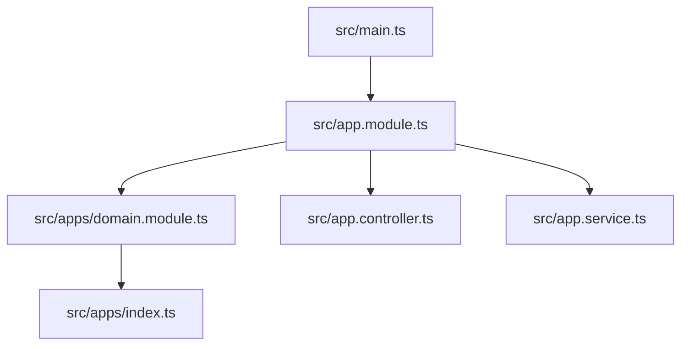
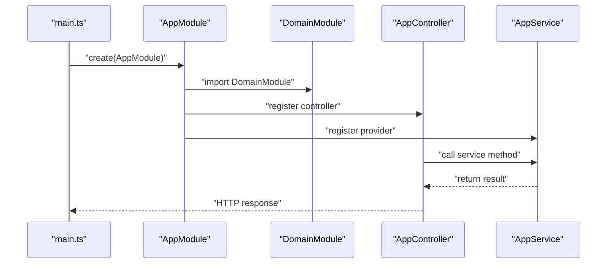
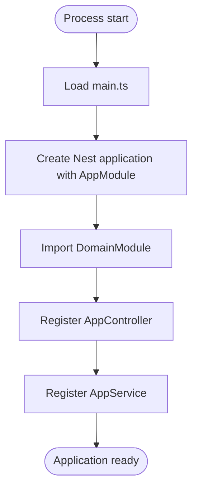
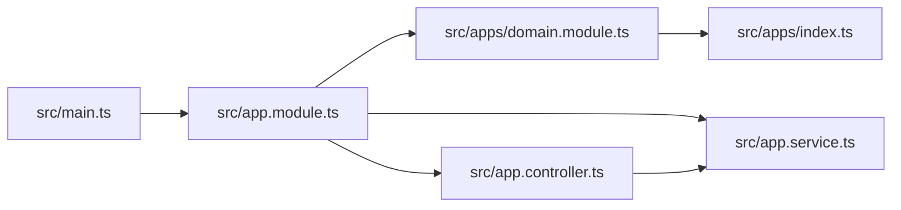

# Module Architecture

<cite>
**Referenced Files in This Document**
- [main.ts](file://src/main.ts)
- [app.module.ts](file://src/app.module.ts)
- [domain.module.ts](file://src/apps/domain.module.ts)
- [index.ts](file://src/apps/index.ts)
- [app.controller.ts](file://src/app.controller.ts)
- [app.service.ts](file://src/app.service.ts)
- [package.json](file://package.json)
</cite>

## Table of Contents
1. [Introduction](#introduction)
2. [Project Structure](#project-structure)
3. [Core Components](#core-components)
4. [Architecture Overview](#architecture-overview)
5. [Detailed Component Analysis](#detailed-component-analysis)
6. [Dependency Analysis](#dependency-analysis)
7. [Performance Considerations](#performance-considerations)
8. [Troubleshooting Guide](#troubleshooting-guide)
9. [Conclusion](#conclusion)
10. [Appendices](#appendices)

## Introduction
This document explains the module architecture of the easysearch-monolith project. It focuses on how NestJS modules organize the application into cohesive functional blocks, the role of the root module, and how modules enable separation of concerns and scalability. It also provides guidance for extending the system with new modules for features such as search, user management, or analytics, while addressing common pitfalls like circular dependencies and module resolution errors.

## Project Structure
The project follows a minimal NestJS layout with a root module that orchestrates imports and exposes a controller and service. The apps directory contains a placeholder module intended for future domain features.

**Diagram sources**
- [main.ts](file://src/main.ts#L1-L9)
- [app.module.ts](file://src/app.module.ts#L1-L13)
- [domain.module.ts](file://src/apps/domain.module.ts#L1-L11)
- [index.ts](file://src/apps/index.ts#L1-L1)
- [app.controller.ts](file://src/app.controller.ts#L1-L13)
- [app.service.ts](file://src/app.service.ts#L1-L9)

**Section sources**
- [main.ts](file://src/main.ts#L1-L9)
- [app.module.ts](file://src/app.module.ts#L1-L13)
- [domain.module.ts](file://src/apps/domain.module.ts#L1-L11)
- [index.ts](file://src/apps/index.ts#L1-L1)
- [app.controller.ts](file://src/app.controller.ts#L1-L13)
- [app.service.ts](file://src/app.service.ts#L1-L9)

## Core Components
- AppModule: The root module that imports DomainModule, declares AppController, and registers AppService as a provider. It is the central coordination point for the application’s wiring.
- DomainModule: A placeholder module under src/apps. It currently declares empty arrays for imports, controllers, providers, and exports, but is designed to host future domain features.
- AppController: A controller that exposes a GET endpoint and delegates to AppService.
- AppService: A simple injectable service that provides the response for the controller.

These components demonstrate the NestJS module pattern: a module encapsulates related functionality and exposes it to other modules through exports, while providers are injected into controllers and services.

**Section sources**
- [app.module.ts](file://src/app.module.ts#L1-L13)
- [domain.module.ts](file://src/apps/domain.module.ts#L1-L11)
- [app.controller.ts](file://src/app.controller.ts#L1-L13)
- [app.service.ts](file://src/app.service.ts#L1-L9)

## Architecture Overview
The runtime bootstrap flow starts from main.ts, which creates the Nest application using AppModule. AppModule then orchestrates DomainModule, AppController, and AppService. Requests flow from the HTTP layer through AppController to AppService.

**Diagram sources**
- [main.ts](file://src/main.ts#L1-L9)
- [app.module.ts](file://src/app.module.ts#L1-L13)
- [domain.module.ts](file://src/apps/domain.module.ts#L1-L11)
- [app.controller.ts](file://src/app.controller.ts#L1-L13)
- [app.service.ts](file://src/app.service.ts#L1-L9)

## Detailed Component Analysis

### AppModule
- Purpose: Root module that wires the application.
- Imports: DomainModule, indicating that future domain features will be grouped under this module.
- Controllers: AppController, exposing the application’s public interface.
- Providers: AppService, providing business logic for the controller.
- Exports: None declared here; DomainModule is imported but not re-exported.

This module exemplifies separation of concerns by delegating domain-specific concerns to DomainModule while keeping the root module focused on orchestration.

**Section sources**
- [app.module.ts](file://src/app.module.ts#L1-L13)

### DomainModule
- Purpose: Placeholder module for domain features. Intended to be extended with domain-specific controllers, providers, and submodules.
- Current state: Empty arrays for imports, controllers, providers, and exports.
- Export strategy: Exported via src/apps/index.ts to simplify imports elsewhere.

Guidance for extension:
- Add domain controllers and providers to DomainModule.
- If domain features are split into submodules, import them in DomainModule.
- Re-export shared domain providers from DomainModule to other modules that depend on it.

**Section sources**
- [domain.module.ts](file://src/apps/domain.module.ts#L1-L11)
- [index.ts](file://src/apps/index.ts#L1-L1)

### AppController
- Purpose: HTTP entry point for the application.
- Behavior: Handles GET requests and delegates to AppService.
- Injection: Receives AppService via constructor injection.

This demonstrates dependency injection in action: the controller depends on AppService, which is provided by AppModule.

**Section sources**
- [app.controller.ts](file://src/app.controller.ts#L1-L13)

### AppService
- Purpose: Provides application logic for the controller.
- Behavior: Returns a simple greeting string.

This illustrates how services encapsulate business logic and are reusable across controllers.

**Section sources**
- [app.service.ts](file://src/app.service.ts#L1-L9)

### Bootstrap Flow
- main.ts creates the Nest application using AppModule.
- AppModule imports DomainModule and registers AppController and AppService.
- Requests are handled by AppController, which invokes AppService.

**Diagram sources**
- [main.ts](file://src/main.ts#L1-L9)
- [app.module.ts](file://src/app.module.ts#L1-L13)

## Dependency Analysis
- main.ts depends on AppModule.
- AppModule depends on DomainModule, AppController, and AppService.
- AppController depends on AppService.
- DomainModule is currently empty but is exported via index.ts for convenient imports.

**Diagram sources**
- [main.ts](file://src/main.ts#L1-L9)
- [app.module.ts](file://src/app.module.ts#L1-L13)
- [domain.module.ts](file://src/apps/domain.module.ts#L1-L11)
- [index.ts](file://src/apps/index.ts#L1-L1)
- [app.controller.ts](file://src/app.controller.ts#L1-L13)
- [app.service.ts](file://src/app.service.ts#L1-L9)

**Section sources**
- [main.ts](file://src/main.ts#L1-L9)
- [app.module.ts](file://src/app.module.ts#L1-L13)
- [domain.module.ts](file://src/apps/domain.module.ts#L1-L11)
- [index.ts](file://src/apps/index.ts#L1-L1)
- [app.controller.ts](file://src/app.controller.ts#L1-L13)
- [app.service.ts](file://src/app.service.ts#L1-L9)

## Performance Considerations
- Keep AppModule lightweight: it should primarily import and wire modules rather than hosting heavy logic.
- Place domain-specific concerns in DomainModule to reduce coupling at the root level.
- Use lazy loading for large domain features to minimize initial startup overhead.
- Avoid unnecessary providers in AppModule; prefer scoped providers in domain modules.

[No sources needed since this section provides general guidance]

## Troubleshooting Guide
Common issues and resolutions:
- Circular dependencies
  - Symptom: Build fails with circular dependency warnings or runtime errors.
  - Resolution: Refactor shared logic into separate modules or use forward references. Avoid importing modules that import back into AppModule.
- Module resolution errors
  - Symptom: Cannot resolve module when importing DomainModule.
  - Resolution: Ensure the import path is correct and that index.ts re-exports DomainModule. Verify that the module is compiled and available in the output directory.
- Missing providers
  - Symptom: AppController constructor injection fails.
  - Resolution: Confirm that AppModule registers the provider and that the provider is decorated appropriately. Ensure the provider is not scoped to a child module without proper export/import.
- Empty DomainModule
  - Symptom: DomainModule appears unused.
  - Resolution: Add domain features to DomainModule and import it from AppModule. Export shared providers from DomainModule to other modules that require them.

**Section sources**
- [app.module.ts](file://src/app.module.ts#L1-L13)
- [domain.module.ts](file://src/apps/domain.module.ts#L1-L11)
- [index.ts](file://src/apps/index.ts#L1-L1)
- [app.controller.ts](file://src/app.controller.ts#L1-L13)
- [app.service.ts](file://src/app.service.ts#L1-L9)

## Conclusion
The easysearch-monolith project demonstrates a clean NestJS module architecture centered around AppModule. DomainModule serves as a strategic placeholder for future domain features, enabling scalable growth without cluttering the root module. The controller-service pattern, combined with explicit imports and exports, enforces separation of concerns and simplifies maintenance. Following the guidance in this document will help you extend the system safely and efficiently.

[No sources needed since this section summarizes without analyzing specific files]

## Appendices

### Creating New Modules
Steps to add a new module (e.g., search, user management, analytics):
1. Create a new module file under src/apps or a dedicated feature directory.
2. Decorate the class with @Module and configure imports, controllers, providers, and exports.
3. Import the new module in AppModule or DomainModule depending on its scope.
4. If the module exposes shared providers, export them from the module so other modules can import them.
5. Register any controllers in the appropriate module and inject providers via constructors.

Example references:
- Root module wiring: [app.module.ts](file://src/app.module.ts#L1-L13)
- Domain module placeholder: [domain.module.ts](file://src/apps/domain.module.ts#L1-L11)
- Export entry point: [index.ts](file://src/apps/index.ts#L1-L1)

**Section sources**
- [app.module.ts](file://src/app.module.ts#L1-L13)
- [domain.module.ts](file://src/apps/domain.module.ts#L1-L11)
- [index.ts](file://src/apps/index.ts#L1-L1)

### Runtime Dependencies
The project uses NestJS v11.x core packages. Ensure consistent versions across @nestjs/common, @nestjs/core, and @nestjs/platform-express.

**Section sources**
- [package.json](file://package.json#L1-L72)