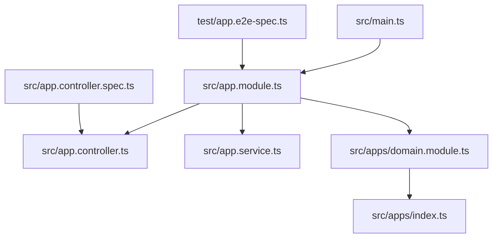
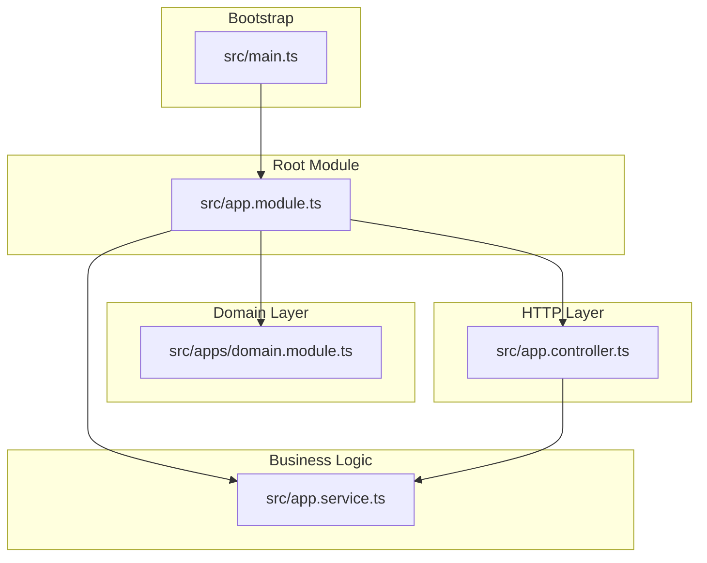
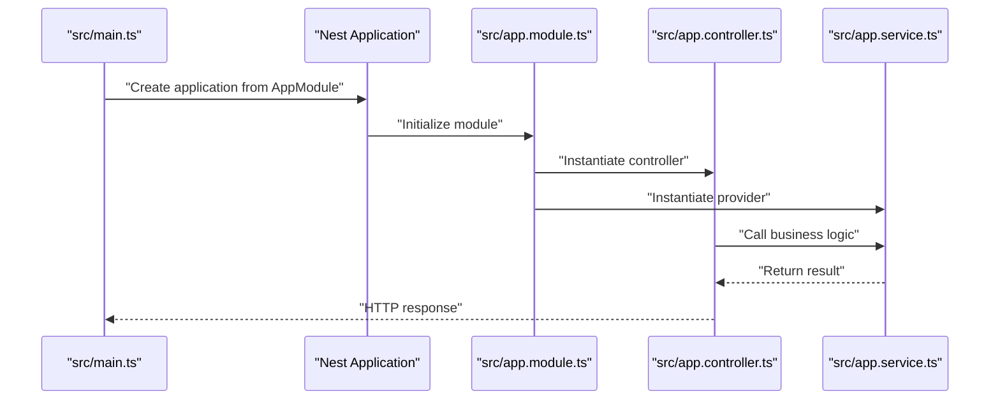
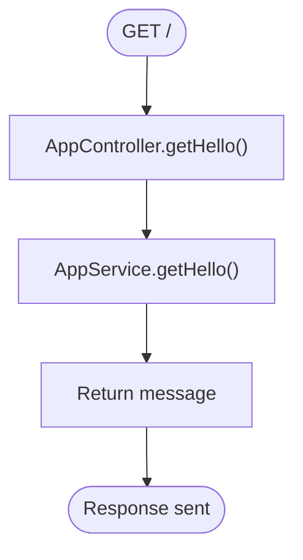
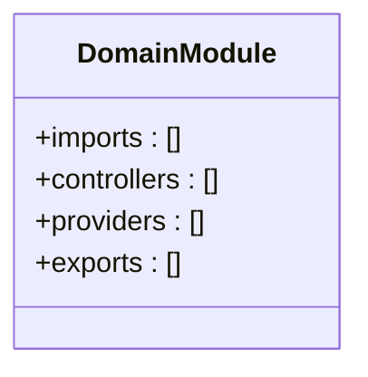
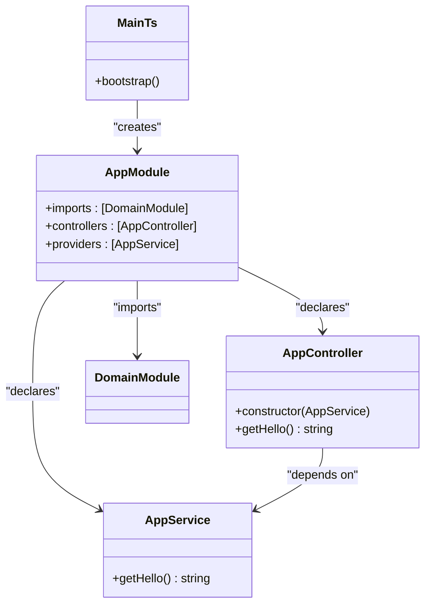
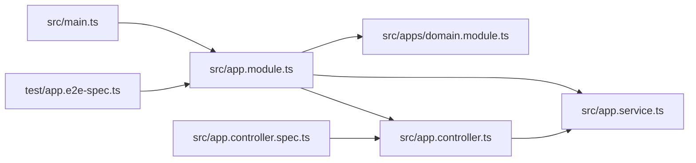

# Project Overview

<cite>
**Referenced Files in This Document**
- [main.ts](file://src/main.ts)
- [app.module.ts](file://src/app.module.ts)
- [app.controller.ts](file://src/app.controller.ts)
- [app.service.ts](file://src/app.service.ts)
- [apps/domain.module.ts](file://src/apps/domain.module.ts)
- [apps/index.ts](file://src/apps/index.ts)
- [app.e2e-spec.ts](file://test/app.e2e-spec.ts)
- [app.controller.spec.ts](file://src/app.controller.spec.ts)
- [package.json](file://package.json)
- [README.md](file://README.md)
</cite>

## Table of Contents
1. [Introduction](#introduction)
2. [Project Structure](#project-structure)
3. [Core Components](#core-components)
4. [Architecture Overview](#architecture-overview)
5. [Detailed Component Analysis](#detailed-component-analysis)
6. [Dependency Analysis](#dependency-analysis)
7. [Performance Considerations](#performance-considerations)
8. [Troubleshooting Guide](#troubleshooting-guide)
9. [Conclusion](#conclusion)

## Introduction
This section introduces the easysearch-monolith project as a foundational NestJS backend service template. Its primary purpose is to serve as a learning scaffold and a scalable monolithic foundation for building search-centric features. While the current implementation exposes a basic “Hello World” API endpoint, the architecture is modular and dependency-injected, enabling straightforward extension into domain-specific capabilities such as indexing, querying, and search orchestration. The project emphasizes clean separation of concerns, testability, and readiness for future search-related enhancements.

## Project Structure
The project follows a typical NestJS layout with a focus on modularity and separation of concerns:
- Entry point initializes the Nest application and binds the root module.
- Root module aggregates domain modules and wires controllers/services.
- A dedicated domain module acts as a placeholder for future domain features.
- Tests demonstrate both unit and end-to-end verification of the root endpoint.

**Diagram sources**
- [main.ts](file://src/main.ts#L1-L9)
- [app.module.ts](file://src/app.module.ts#L1-L13)
- [app.controller.ts](file://src/app.controller.ts#L1-L13)
- [app.service.ts](file://src/app.service.ts#L1-L9)
- [apps/domain.module.ts](file://src/apps/domain.module.ts#L1-L11)
- [apps/index.ts](file://src/apps/index.ts#L1-L1)
- [app.e2e-spec.ts](file://test/app.e2e-spec.ts#L1-L26)
- [app.controller.spec.ts](file://src/app.controller.spec.ts#L1-L23)

**Section sources**
- [main.ts](file://src/main.ts#L1-L9)
- [app.module.ts](file://src/app.module.ts#L1-L13)
- [apps/domain.module.ts](file://src/apps/domain.module.ts#L1-L11)
- [apps/index.ts](file://src/apps/index.ts#L1-L1)
- [app.e2e-spec.ts](file://test/app.e2e-spec.ts#L1-L26)
- [app.controller.spec.ts](file://src/app.controller.spec.ts#L1-L23)

## Core Components
- Application entry point: Initializes the Nest application and starts listening on the configured port.
- Root module: Declares the controller and provider, and imports the domain module.
- Controller: Exposes a GET endpoint that delegates to the service.
- Service: Provides the business logic for the root endpoint.
- Domain module: Placeholder module for future domain features; currently empty but exportable.

Practical examples from the codebase:
- Root GET endpoint behavior is validated by an end-to-end test that asserts the response.
- Unit tests validate the controller’s behavior independently of HTTP transport.
- The domain module acts as a staging area for domain-specific controllers and providers.

**Section sources**
- [main.ts](file://src/main.ts#L1-L9)
- [app.module.ts](file://src/app.module.ts#L1-L13)
- [app.controller.ts](file://src/app.controller.ts#L1-L13)
- [app.service.ts](file://src/app.service.ts#L1-L9)
- [apps/domain.module.ts](file://src/apps/domain.module.ts#L1-L11)
- [app.e2e-spec.ts](file://test/app.e2e-spec.ts#L1-L26)
- [app.controller.spec.ts](file://src/app.controller.spec.ts#L1-L23)

## Architecture Overview
The system follows a layered, modular NestJS architecture:
- Entry point creates the application using the root module.
- Root module orchestrates controllers and providers and imports the domain module.
- Controllers handle HTTP requests and delegate to services.
- Services encapsulate business logic and are injectable across the application.
- Domain module serves as a container for domain-specific features and can be extended independently.

**Diagram sources**
- [main.ts](file://src/main.ts#L1-L9)
- [app.module.ts](file://src/app.module.ts#L1-L13)
- [app.controller.ts](file://src/app.controller.ts#L1-L13)
- [app.service.ts](file://src/app.service.ts#L1-L9)
- [apps/domain.module.ts](file://src/apps/domain.module.ts#L1-L11)

## Detailed Component Analysis

### Application Lifecycle and Control Flow
The lifecycle begins at the entry point, proceeds through module wiring, and culminates in the controller responding to the root GET endpoint.

**Diagram sources**
- [main.ts](file://src/main.ts#L1-L9)
- [app.module.ts](file://src/app.module.ts#L1-L13)
- [app.controller.ts](file://src/app.controller.ts#L1-L13)
- [app.service.ts](file://src/app.service.ts#L1-L9)

**Section sources**
- [main.ts](file://src/main.ts#L1-L9)
- [app.module.ts](file://src/app.module.ts#L1-L13)
- [app.controller.ts](file://src/app.controller.ts#L1-L13)
- [app.service.ts](file://src/app.service.ts#L1-L9)

### Root GET Endpoint Behavior
The root GET endpoint delegates to the service and returns a simple message. This behavior is verified by:
- An end-to-end test asserting the HTTP response.
- A unit test verifying the controller’s method returns the expected value.

**Diagram sources**
- [app.controller.ts](file://src/app.controller.ts#L1-L13)
- [app.service.ts](file://src/app.service.ts#L1-L9)
- [app.e2e-spec.ts](file://test/app.e2e-spec.ts#L1-L26)
- [app.controller.spec.ts](file://src/app.controller.spec.ts#L1-L23)

**Section sources**
- [app.controller.ts](file://src/app.controller.ts#L1-L13)
- [app.service.ts](file://src/app.service.ts#L1-L9)
- [app.e2e-spec.ts](file://test/app.e2e-spec.ts#L1-L26)
- [app.controller.spec.ts](file://src/app.controller.spec.ts#L1-L23)

### Domain Module as Extension Point
The domain module is intentionally minimal and exportable, serving as a staging area for domain features. It currently:
- Imports no external modules.
- Exports no controllers/providers.
- Can be extended to host domain-specific controllers and providers.

**Diagram sources**
- [apps/domain.module.ts](file://src/apps/domain.module.ts#L1-L11)
- [apps/index.ts](file://src/apps/index.ts#L1-L1)

**Section sources**
- [apps/domain.module.ts](file://src/apps/domain.module.ts#L1-L11)
- [apps/index.ts](file://src/apps/index.ts#L1-L1)

### Relationship Between main.ts, AppModule, AppController, and AppService
- main.ts creates the Nest application using AppModule.
- AppModule declares AppController and AppService, and imports the domain module.
- AppController depends on AppService and exposes the root GET endpoint.
- AppService encapsulates the business logic for the endpoint.

**Diagram sources**
- [main.ts](file://src/main.ts#L1-L9)
- [app.module.ts](file://src/app.module.ts#L1-L13)
- [app.controller.ts](file://src/app.controller.ts#L1-L13)
- [app.service.ts](file://src/app.service.ts#L1-L9)
- [apps/domain.module.ts](file://src/apps/domain.module.ts#L1-L11)

**Section sources**
- [main.ts](file://src/main.ts#L1-L9)
- [app.module.ts](file://src/app.module.ts#L1-L13)
- [app.controller.ts](file://src/app.controller.ts#L1-L13)
- [app.service.ts](file://src/app.service.ts#L1-L9)
- [apps/domain.module.ts](file://src/apps/domain.module.ts#L1-L11)

## Dependency Analysis
- Entry point depends on the root module.
- Root module depends on the domain module, controller, and service.
- Controller depends on the service.
- Domain module is currently empty but exportable for future expansion.
- Tests depend on the module and controller/service for verification.

**Diagram sources**
- [main.ts](file://src/main.ts#L1-L9)
- [app.module.ts](file://src/app.module.ts#L1-L13)
- [apps/domain.module.ts](file://src/apps/domain.module.ts#L1-L11)
- [app.controller.ts](file://src/app.controller.ts#L1-L13)
- [app.service.ts](file://src/app.service.ts#L1-L9)
- [app.e2e-spec.ts](file://test/app.e2e-spec.ts#L1-L26)
- [app.controller.spec.ts](file://src/app.controller.spec.ts#L1-L23)

**Section sources**
- [main.ts](file://src/main.ts#L1-L9)
- [app.module.ts](file://src/app.module.ts#L1-L13)
- [app.controller.ts](file://src/app.controller.ts#L1-L13)
- [app.service.ts](file://src/app.service.ts#L1-L9)
- [apps/domain.module.ts](file://src/apps/domain.module.ts#L1-L11)
- [app.e2e-spec.ts](file://test/app.e2e-spec.ts#L1-L26)
- [app.controller.spec.ts](file://src/app.controller.spec.ts#L1-L23)

## Performance Considerations
- The current implementation is lightweight and suitable for learning and small-scale usage.
- As the application grows, consider adding caching, logging, and monitoring layers.
- Keep controllers thin and delegate business logic to services for testability and performance profiling.
- Use lazy loading and feature-based module boundaries to manage complexity.

## Troubleshooting Guide
- Port binding: If the application fails to start, verify the configured port and environment availability.
- Module resolution: Ensure the domain module export path is correct and the index re-exports the module.
- Tests: Run unit and end-to-end tests to confirm the root endpoint behavior and module wiring.

**Section sources**
- [main.ts](file://src/main.ts#L1-L9)
- [apps/index.ts](file://src/apps/index.ts#L1-L1)
- [app.e2e-spec.ts](file://test/app.e2e-spec.ts#L1-L26)
- [app.controller.spec.ts](file://src/app.controller.spec.ts#L1-L23)

## Conclusion
The easysearch-monolith project provides a clean, modular foundation for building NestJS-based search services. It demonstrates core NestJS patterns—modular design, dependency injection, and test-driven development—while keeping the door open for future search capabilities. Beginners can use it as a learning template, and experienced developers can extend it confidently with domain modules, services, and controllers aligned with NestJS best practices.