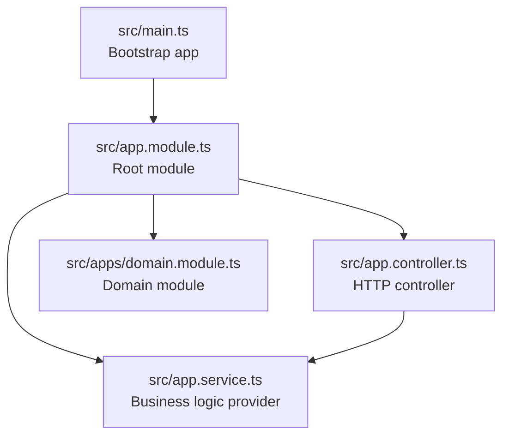
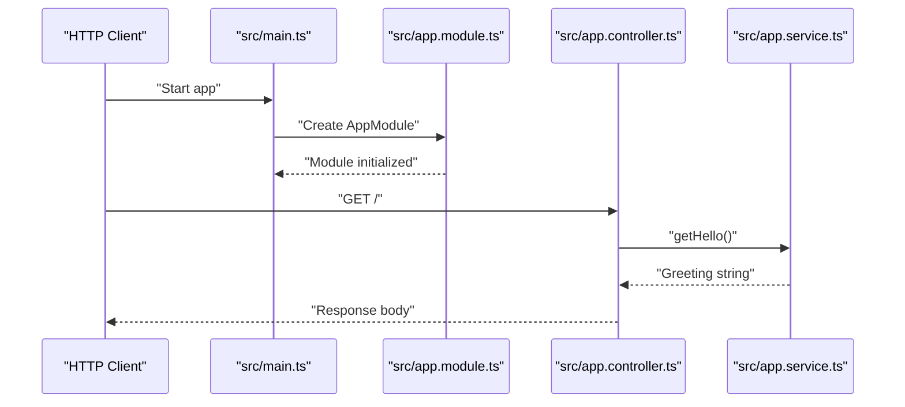
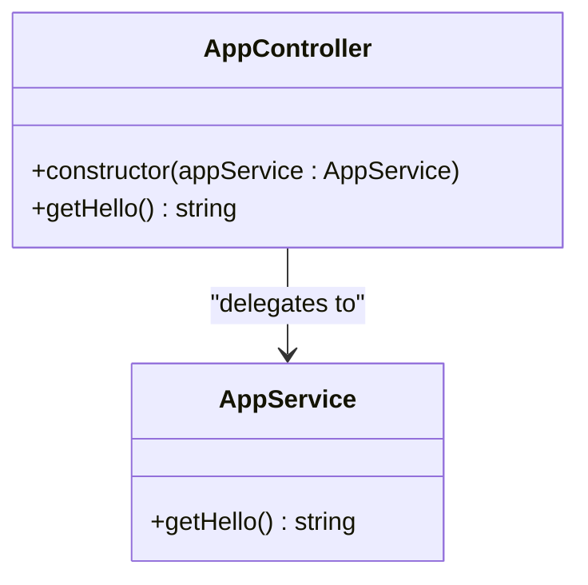
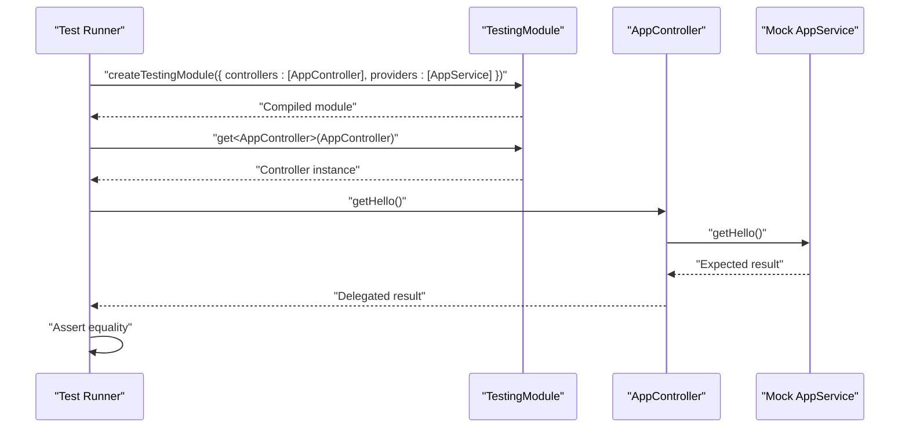
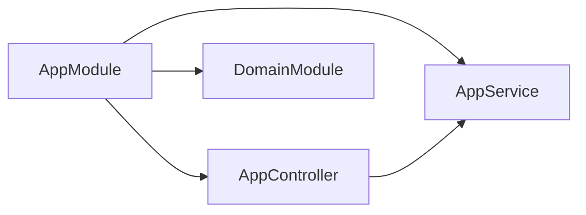

# Service Layer

<cite>
**Referenced Files in This Document**
- [src/app.service.ts](file://src/app.service.ts)
- [src/app.controller.ts](file://src/app.controller.ts)
- [src/app.module.ts](file://src/app.module.ts)
- [src/main.ts](file://src/main.ts)
- [src/app.controller.spec.ts](file://src/app.controller.spec.ts)
- [src/apps/domain.module.ts](file://src/apps/domain.module.ts)
- [src/apps/index.ts](file://src/apps/index.ts)
</cite>

## Table of Contents
1. [Introduction](#introduction)
2. [Project Structure](#project-structure)
3. [Core Components](#core-components)
4. [Architecture Overview](#architecture-overview)
5. [Detailed Component Analysis](#detailed-component-analysis)
6. [Dependency Analysis](#dependency-analysis)
7. [Performance Considerations](#performance-considerations)
8. [Troubleshooting Guide](#troubleshooting-guide)
9. [Conclusion](#conclusion)
10. [Appendices](#appendices)

## Introduction
This document explains the service layer in the easysearch-monolith application with a focus on AppService as the business logic provider. The current implementation exposes a single method that returns a greeting string. The document demonstrates how the @Injectable() decorator and NestJS dependency injection enable clean separation between the controller and service, enabling testability, reusability, and adherence to layered architecture. It also provides guidance on extending the service with additional business logic, integrating external APIs, and organizing domain rules, while highlighting testing best practices and how to mock services in unit tests.

## Project Structure
The application follows a minimal NestJS structure:
- A root module wires together the controller, service, and a domain module.
- The controller exposes an HTTP endpoint that delegates to the service.
- The service encapsulates business logic and is decorated for DI.
- The main entry point bootstraps the application.

**Diagram sources**
- [src/main.ts](file://src/main.ts#L1-L9)
- [src/app.module.ts](file://src/app.module.ts#L1-L13)
- [src/app.controller.ts](file://src/app.controller.ts#L1-L13)
- [src/app.service.ts](file://src/app.service.ts#L1-L9)
- [src/apps/domain.module.ts](file://src/apps/domain.module.ts#L1-L11)

**Section sources**
- [src/main.ts](file://src/main.ts#L1-L9)
- [src/app.module.ts](file://src/app.module.ts#L1-L13)
- [src/app.controller.ts](file://src/app.controller.ts#L1-L13)
- [src/app.service.ts](file://src/app.service.ts#L1-L9)
- [src/apps/domain.module.ts](file://src/apps/domain.module.ts#L1-L11)

## Core Components
- AppService: Encapsulates business logic and is decorated with @Injectable() so NestJS can inject it into controllers and other services. It currently exposes a method returning a greeting string.
- AppController: Handles HTTP requests and delegates to AppService via constructor injection.
- AppModule: Declares the controller and provider, and imports the DomainModule.
- DomainModule: A placeholder module exported by the apps package; it currently declares no controllers/providers but can host domain services or repositories in the future.

Key DI and separation benefits:
- Clean separation: Controller focuses on HTTP concerns; service encapsulates business logic.
- Testability: Controllers can be tested by injecting a mock AppService.
- Reusability: Services can be consumed by multiple controllers or other services.
- Extensibility: Additional business methods can be added to AppService without changing the controller.

**Section sources**
- [src/app.service.ts](file://src/app.service.ts#L1-L9)
- [src/app.controller.ts](file://src/app.controller.ts#L1-L13)
- [src/app.module.ts](file://src/app.module.ts#L1-L13)
- [src/apps/domain.module.ts](file://src/apps/domain.module.ts#L1-L11)
- [src/apps/index.ts](file://src/apps/index.ts#L1-L1)

## Architecture Overview
The runtime flow from HTTP request to business logic is straightforward:
- The NestJS application is created in main.ts.
- AppModule registers AppController and AppService.
- When an HTTP GET request arrives at the controller’s route, the controller invokes the service method and returns the result.

**Diagram sources**
- [src/main.ts](file://src/main.ts#L1-L9)
- [src/app.module.ts](file://src/app.module.ts#L1-L13)
- [src/app.controller.ts](file://src/app.controller.ts#L1-L13)
- [src/app.service.ts](file://src/app.service.ts#L1-L9)

## Detailed Component Analysis

### AppService: Business Logic Provider
- Purpose: Hosts business logic methods. Currently provides a greeting method.
- Decorator: @Injectable() marks the class for NestJS dependency injection.
- Design: Single-responsibility method for now; ideal candidate for expansion with domain rules, data processing, or external API calls.

Best practices for evolving AppService:
- Encapsulate domain rules in dedicated methods to keep the controller thin.
- For data processing, isolate transformations and validations in service methods.
- For external API calls, centralize them in the service and handle errors consistently.
- Keep methods pure or deterministic when possible; introduce side effects via injected collaborators (e.g., repositories or clients) rather than embedding them inside the service.

Extensibility examples (conceptual):
- Add methods for transforming or validating data.
- Introduce methods that orchestrate calls to external systems.
- Extract domain-specific logic into separate service classes and compose them via constructor injection.

**Section sources**
- [src/app.service.ts](file://src/app.service.ts#L1-L9)

### AppController: HTTP Entry Point
- Purpose: Exposes HTTP endpoints and delegates to AppService.
- Constructor injection: Receives AppService instance from the DI container.
- Delegation: The GET handler calls the service method and returns the result.

**Diagram sources**
- [src/app.controller.ts](file://src/app.controller.ts#L1-L13)
- [src/app.service.ts](file://src/app.service.ts#L1-L9)

**Section sources**
- [src/app.controller.ts](file://src/app.controller.ts#L1-L13)

### AppModule: Module Declaration and DI Container
- Imports: Registers DomainModule.
- Controllers: Declares AppController.
- Providers: Registers AppService as a provider, making it injectable.

Implications:
- AppModule acts as the DI container boundary for this layer.
- AppService becomes available to AppController and any other module that imports AppModule.

**Section sources**
- [src/app.module.ts](file://src/app.module.ts#L1-L13)
- [src/apps/domain.module.ts](file://src/apps/domain.module.ts#L1-L11)
- [src/apps/index.ts](file://src/apps/index.ts#L1-L1)

### DomainModule: Domain Boundary
- Current state: Empty module exporting itself.
- Future role: Can host domain services, repositories, or domain-specific providers that AppService can depend on.

**Section sources**
- [src/apps/domain.module.ts](file://src/apps/domain.module.ts#L1-L11)
- [src/apps/index.ts](file://src/apps/index.ts#L1-L1)

### Testing AppController with a Mock Service
Unit testing strategy:
- Use NestJS TestingModule to compile a module with the controller and a mock provider.
- Retrieve the controller instance and assert behavior without invoking external systems.

Practical tips:
- Replace the real AppService with a mock object in tests to isolate controller behavior.
- Verify that the controller calls the service method and returns the expected value.
- Keep tests focused on the controller’s delegation logic.

**Diagram sources**
- [src/app.controller.spec.ts](file://src/app.controller.spec.ts#L1-L23)
- [src/app.controller.ts](file://src/app.controller.ts#L1-L13)
- [src/app.service.ts](file://src/app.service.ts#L1-L9)

**Section sources**
- [src/app.controller.spec.ts](file://src/app.controller.spec.ts#L1-L23)

## Dependency Analysis
The dependency relationships are intentionally simple and demonstrate clean DI boundaries:
- AppController depends on AppService.
- AppModule registers both and makes them available to the runtime.
- DomainModule is imported by AppModule but currently contributes nothing.

**Diagram sources**
- [src/app.module.ts](file://src/app.module.ts#L1-L13)
- [src/app.controller.ts](file://src/app.controller.ts#L1-L13)
- [src/app.service.ts](file://src/app.service.ts#L1-L9)
- [src/apps/domain.module.ts](file://src/apps/domain.module.ts#L1-L11)

**Section sources**
- [src/app.module.ts](file://src/app.module.ts#L1-L13)
- [src/app.controller.ts](file://src/app.controller.ts#L1-L13)
- [src/app.service.ts](file://src/app.service.ts#L1-L9)
- [src/apps/domain.module.ts](file://src/apps/domain.module.ts#L1-L11)

## Performance Considerations
- Keep service methods lightweight and deterministic to minimize overhead.
- Avoid heavy synchronous operations in hot paths; defer to asynchronous tasks or queues when appropriate.
- Centralize external calls in services to enable caching or retry strategies at the service level.
- Favor small, composable services to reduce coupling and improve testability.

[No sources needed since this section provides general guidance]

## Troubleshooting Guide
Common issues and resolutions:
- Missing provider registration: Ensure the service is included in providers within the module that owns the controller.
- Incorrect DI scope: If the service needs to maintain state across requests, verify its scope and lifecycle.
- Testing pitfalls: When mocking, ensure the mock returns the expected value and that the controller method is invoked during assertions.

**Section sources**
- [src/app.module.ts](file://src/app.module.ts#L1-L13)
- [src/app.controller.spec.ts](file://src/app.controller.spec.ts#L1-L23)

## Conclusion
The current service layer in easysearch-monolith cleanly separates HTTP concerns from business logic via AppService and constructor injection. The @Injectable() decorator and NestJS DI enable testability and reusability. As the application grows, extend AppService with domain rules, data processing, and external integrations while keeping the controller thin. Use modularization and mocking in tests to maintain reliability and clarity.

[No sources needed since this section summarizes without analyzing specific files]

## Appendices

### Best Practices for Organizing Business Logic in Services
- Encapsulate domain logic in service methods; avoid duplicating logic across controllers.
- Use dependency injection to receive collaborators (repositories, clients, or other services) rather than instantiating them inside the service.
- Keep methods focused and testable; extract complex logic into smaller helper methods or dedicated services.
- Centralize error handling and logging in services to maintain consistent behavior.

[No sources needed since this section provides general guidance]

### Guidance on Sharing Services Across Controllers
- Register the service in a module that is imported by multiple controllers.
- Inject the service into each controller via constructor injection.
- Keep shared logic in the service to avoid duplication.

[No sources needed since this section provides general guidance]

### Guidance on Injecting Other Services or Repositories
- Define interfaces for collaborators to enable easy mocking.
- Inject collaborators via constructor injection to satisfy the dependency inversion principle.
- Export services from feature modules to make them available across the application.

[No sources needed since this section provides general guidance]