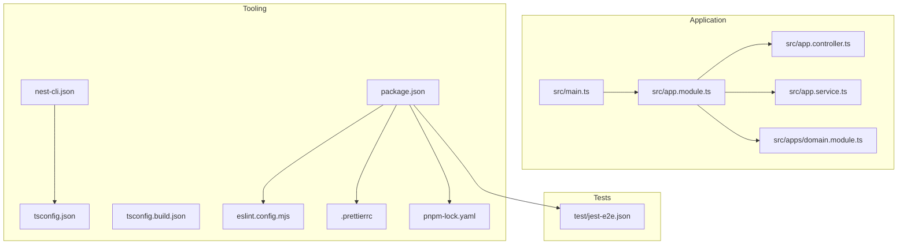
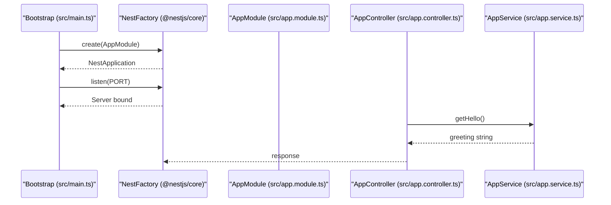
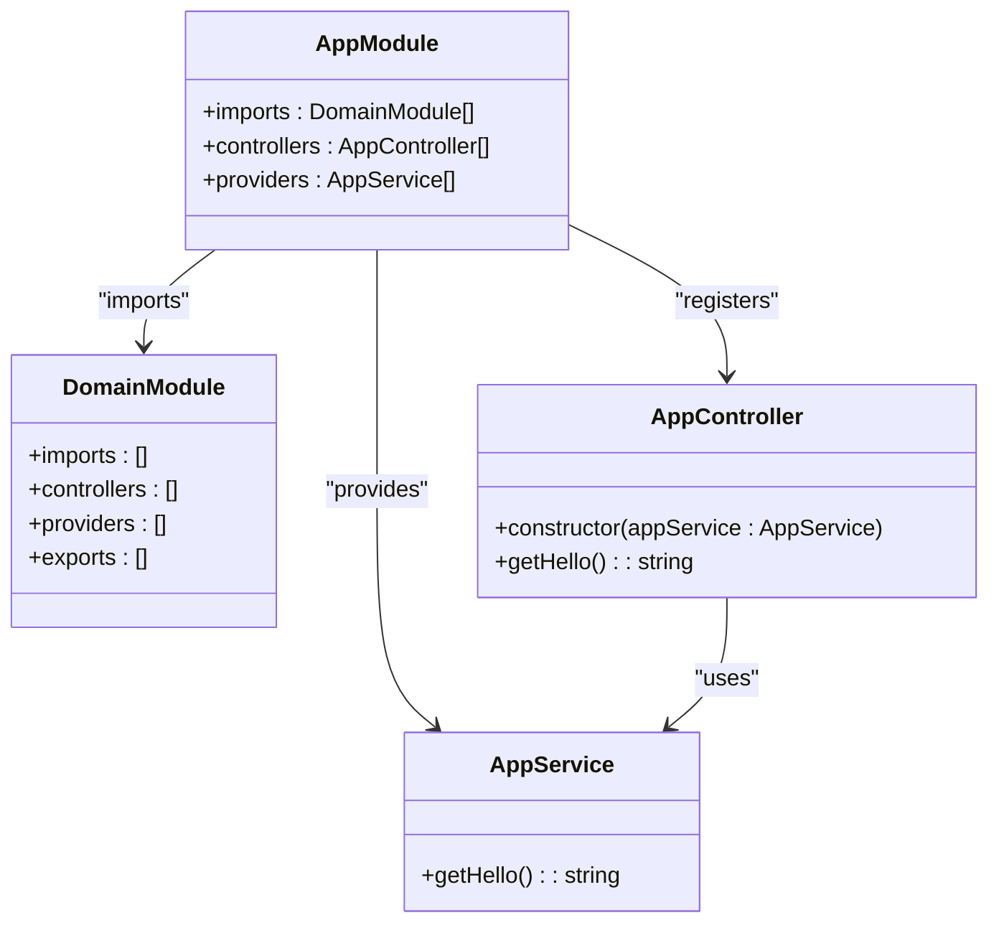
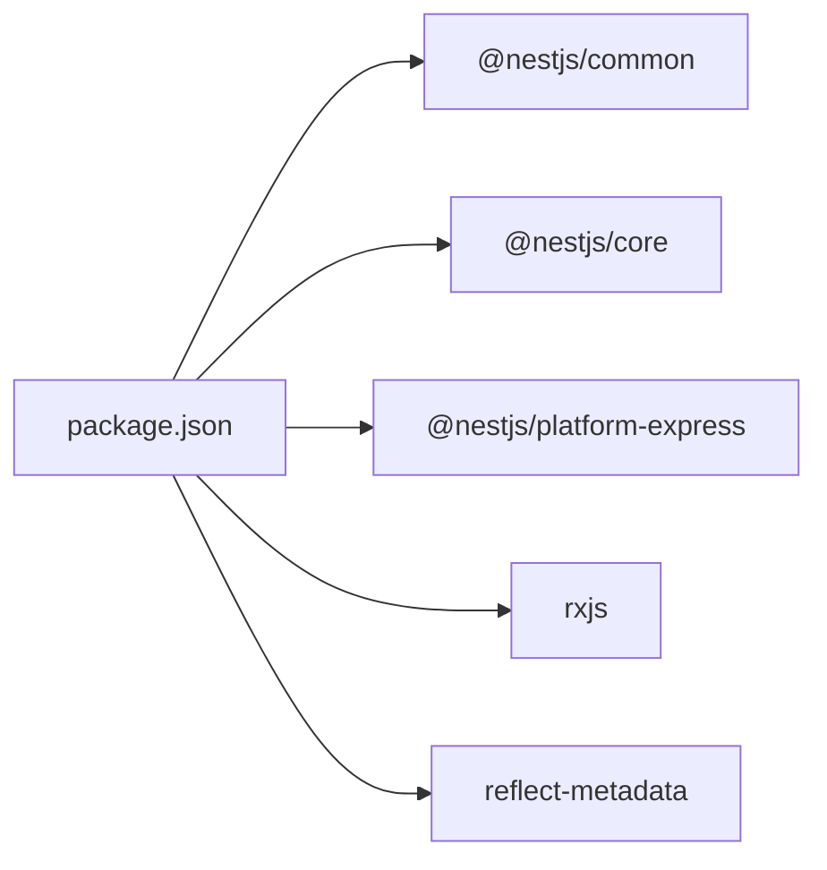

# Technology Stack & Dependencies

<cite>
**Referenced Files in This Document**
- [package.json](file://package.json)
- [tsconfig.json](file://tsconfig.json)
- [tsconfig.build.json](file://tsconfig.build.json)
- [nest-cli.json](file://nest-cli.json)
- [eslint.config.mjs](file://eslint.config.mjs)
- [.prettierrc](file://.prettierrc)
- [pnpm-lock.yaml](file://pnpm-lock.yaml)
- [src/main.ts](file://src/main.ts)
- [src/app.module.ts](file://src/app.module.ts)
- [src/app.controller.ts](file://src/app.controller.ts)
- [src/app.service.ts](file://src/app.service.ts)
- [src/apps/domain.module.ts](file://src/apps/domain.module.ts)
- [test/jest-e2e.json](file://test/jest-e2e.json)
- [README.md](file://README.md)
</cite>

## Table of Contents
1. [Introduction](#introduction)
2. [Project Structure](#project-structure)
3. [Core Components](#core-components)
4. [Architecture Overview](#architecture-overview)
5. [Detailed Component Analysis](#detailed-component-analysis)
6. [Dependency Analysis](#dependency-analysis)
7. [Performance Considerations](#performance-considerations)
8. [Troubleshooting Guide](#troubleshooting-guide)
9. [Conclusion](#conclusion)
10. [Appendices](#appendices)

## Introduction
This section documents the technology stack used in the easysearch-monolith project. It explains how NestJS serves as the core framework, integrates with Express for HTTP handling, and leverages TypeScript for type safety and developer productivity. It also covers key dependencies, development tooling (Nest CLI, ESLint, Prettier, Jest), and the package manager (pnpm). Finally, it provides guidance on extending the stack for databases, authentication, and caching.

## Project Structure
The project follows a typical NestJS monorepo-like layout with a single application module and a minimal domain module placeholder. The Nest CLI configuration defines the source root and compiler options, while TypeScript configuration controls compilation behavior. ESLint and Prettier enforce code quality and formatting. Tests are configured for unit and end-to-end scenarios.

**Diagram sources**
- [src/main.ts](file://src/main.ts#L1-L9)
- [src/app.module.ts](file://src/app.module.ts#L1-L13)
- [src/app.controller.ts](file://src/app.controller.ts#L1-L13)
- [src/app.service.ts](file://src/app.service.ts#L1-L9)
- [src/apps/domain.module.ts](file://src/apps/domain.module.ts#L1-L11)
- [nest-cli.json](file://nest-cli.json#L1-L9)
- [tsconfig.json](file://tsconfig.json#L1-L26)
- [tsconfig.build.json](file://tsconfig.build.json)
- [eslint.config.mjs](file://eslint.config.mjs#L1-L36)
- [.prettierrc](file://.prettierrc#L1-L5)
- [package.json](file://package.json#L1-L72)
- [pnpm-lock.yaml](file://pnpm-lock.yaml#L1-L200)
- [test/jest-e2e.json](file://test/jest-e2e.json#L1-L10)

**Section sources**
- [src/main.ts](file://src/main.ts#L1-L9)
- [src/app.module.ts](file://src/app.module.ts#L1-L13)
- [src/app.controller.ts](file://src/app.controller.ts#L1-L13)
- [src/app.service.ts](file://src/app.service.ts#L1-L9)
- [src/apps/domain.module.ts](file://src/apps/domain.module.ts#L1-L11)
- [nest-cli.json](file://nest-cli.json#L1-L9)
- [tsconfig.json](file://tsconfig.json#L1-L26)
- [tsconfig.build.json](file://tsconfig.build.json)
- [eslint.config.mjs](file://eslint.config.mjs#L1-L36)
- [.prettierrc](file://.prettierrc#L1-L5)
- [package.json](file://package.json#L1-L72)
- [pnpm-lock.yaml](file://pnpm-lock.yaml#L1-L200)
- [test/jest-e2e.json](file://test/jest-e2e.json#L1-L10)
- [README.md](file://README.md#L24-L58)

## Core Components
- NestJS Core: Provides the application bootstrap, DI container, decorators, and module system. The application starts by creating an application instance from the root module and listening on a port.
- Express Platform: NestJS uses Express under the hood for HTTP handling. The platform adapter is configured via the Nest platform package.
- TypeScript: The project compiles TypeScript to JavaScript with modern target and strictness options. Decorators and metadata are enabled for NestJS features.
- Tooling:
  - Nest CLI: Scaffolding and build orchestration, configured with source root and output deletion behavior.
  - ESLint: Configured with TypeScript and Prettier recommended rules, plus custom rules for safer code.
  - Prettier: Formatting rules enforced via ESLint plugin.
  - Jest: Unit and E2E testing with ts-jest transform and coverage collection.

Key runtime dependencies include NestJS core packages and RxJS. Development dependencies include Nest CLI, TypeScript tooling, ESLint ecosystem, Jest, and Prettier.

**Section sources**
- [src/main.ts](file://src/main.ts#L1-L9)
- [package.json](file://package.json#L22-L53)
- [tsconfig.json](file://tsconfig.json#L1-L26)
- [nest-cli.json](file://nest-cli.json#L1-L9)
- [eslint.config.mjs](file://eslint.config.mjs#L1-L36)
- [.prettierrc](file://.prettierrc#L1-L5)
- [test/jest-e2e.json](file://test/jest-e2e.json#L1-L10)

## Architecture Overview
The application bootstraps via the Nest factory, instantiating the root module and starting the HTTP server. Controllers and services are wired through the module system. Testing is supported through Jest with ts-jest for TypeScript transforms.

**Diagram sources**
- [src/main.ts](file://src/main.ts#L1-L9)
- [src/app.module.ts](file://src/app.module.ts#L1-L13)
- [src/app.controller.ts](file://src/app.controller.ts#L1-L13)
- [src/app.service.ts](file://src/app.service.ts#L1-L9)

**Section sources**
- [src/main.ts](file://src/main.ts#L1-L9)
- [src/app.module.ts](file://src/app.module.ts#L1-L13)
- [src/app.controller.ts](file://src/app.controller.ts#L1-L13)
- [src/app.service.ts](file://src/app.service.ts#L1-L9)

## Detailed Component Analysis

### NestJS Core and Express Integration
- NestJS provides a structured, modular architecture with dependency injection and decorators. The root module imports the domain module and registers the controller and provider.
- The platform adapter integrates Express for HTTP transport. The application listens on the configured port during bootstrap.

**Diagram sources**
- [src/app.module.ts](file://src/app.module.ts#L1-L13)
- [src/apps/domain.module.ts](file://src/apps/domain.module.ts#L1-L11)
- [src/app.controller.ts](file://src/app.controller.ts#L1-L13)
- [src/app.service.ts](file://src/app.service.ts#L1-L9)

**Section sources**
- [src/app.module.ts](file://src/app.module.ts#L1-L13)
- [src/apps/domain.module.ts](file://src/apps/domain.module.ts#L1-L11)
- [src/app.controller.ts](file://src/app.controller.ts#L1-L13)
- [src/app.service.ts](file://src/app.service.ts#L1-L9)

### TypeScript Configuration and Compilation
- Compiler options target modern ECMAScript and enable decorators and metadata for NestJS features.
- Strict null checks and incremental builds improve reliability and build performance.
- Output directory and source maps are configured for development and production builds.

Best practices:
- Keep target aligned with runtime Node.js capabilities.
- Enable decorator metadata and emit decorator metadata for DI.
- Use isolated modules and skipLibCheck for faster builds.

**Section sources**
- [tsconfig.json](file://tsconfig.json#L1-L26)
- [tsconfig.build.json](file://tsconfig.build.json)

### Nest CLI Configuration
- Source root is set to src, and the output directory is cleaned automatically during compilation.
- This ensures consistent module resolution and build hygiene.

**Section sources**
- [nest-cli.json](file://nest-cli.json#L1-L9)

### ESLint and Prettier
- ESLint configuration enables TypeScript recommended rules, type-checked configurations, and Prettier recommended rules.
- Global environments include Node and Jest for accurate linting.
- Custom rules adjust severity for floating promises and unsafe arguments, and enforce Prettier formatting.

Formatting:
- Single quotes and trailing commas are enforced via Prettier configuration.

**Section sources**
- [eslint.config.mjs](file://eslint.config.mjs#L1-L36)
- [.prettierrc](file://.prettierrc#L1-L5)

### Testing with Jest
- Unit tests use ts-jest to transform TypeScript files and collect coverage across all TypeScript files.
- E2E tests are configured separately with a dedicated Jest configuration file.
- Scripts support watch mode, coverage reports, and debug sessions.

**Section sources**
- [package.json](file://package.json#L54-L70)
- [test/jest-e2e.json](file://test/jest-e2e.json#L1-L10)

### Package Manager: pnpm
- The lockfile confirms the installed versions of dependencies, including NestJS core packages, TypeScript, ESLint ecosystem, Jest, and Prettier.
- pnpm is used for installation and script execution as documented in the README.

**Section sources**
- [pnpm-lock.yaml](file://pnpm-lock.yaml#L1-L200)
- [README.md](file://README.md#L24-L58)

## Dependency Analysis
The project’s runtime dependencies center on NestJS core packages and RxJS. Development dependencies provide tooling for building, linting, formatting, and testing. The lockfile ensures deterministic installs.

**Diagram sources**
- [package.json](file://package.json#L22-L53)
- [pnpm-lock.yaml](file://pnpm-lock.yaml#L1-L200)

**Section sources**
- [package.json](file://package.json#L22-L53)
- [pnpm-lock.yaml](file://pnpm-lock.yaml#L1-L200)

## Performance Considerations
- Use incremental builds and skipLibCheck to speed up TypeScript compilation.
- Keep target aligned with Node.js runtime to avoid unnecessary transpilation.
- Prefer lazy loading and feature-based modules to reduce initial load time.
- Leverage Jest’s watch mode for rapid feedback during development.

[No sources needed since this section provides general guidance]

## Troubleshooting Guide
- Build failures due to TypeScript strictness: Review tsconfig options and resolve type errors incrementally.
- Lint errors: Address ESLint warnings and errors; ensure Prettier formatting is applied via scripts.
- Test failures: Verify Jest configuration and ensure ts-jest is correctly transforming TypeScript files.
- Port conflicts: Adjust the listening port in the bootstrap file if the default port is unavailable.

**Section sources**
- [tsconfig.json](file://tsconfig.json#L1-L26)
- [eslint.config.mjs](file://eslint.config.mjs#L1-L36)
- [package.json](file://package.json#L54-L70)
- [src/main.ts](file://src/main.ts#L1-L9)

## Conclusion
The easysearch-monolith project establishes a solid foundation using NestJS, Express, and TypeScript. The toolchain (Nest CLI, ESLint, Prettier, Jest) enforces code quality and simplifies development. The stack is designed for scalability and maintainability, with clear separation of concerns and modular architecture.

[No sources needed since this section summarizes without analyzing specific files]

## Appendices

### Extending the Stack: Recommendations
- Databases:
  - Use @nestjs/typeorm with TypeORM or @nestjs/mongoose with Mongoose for ORM/ODM integrations.
  - Add connection configuration and entity/model definitions in feature modules.
- Authentication:
  - Use @nestjs/passport with Passport strategies for session or JWT-based authentication.
  - Integrate @nestjs/jwt for token handling and protect routes with guards.
- Caching:
  - Use @nestjs/cache-manager with Redis or memory stores for caching strategies.
  - Configure cache TTL and invalidation policies per feature needs.
- Monitoring and Observability:
  - Add @nestjs/axios for HTTP clients and integrate logging/metrics libraries.
- Validation and Serialization:
  - Use class-validator and class-transformer for DTO validation and serialization.
- Swagger/OpenAPI:
  - Use @nestjs/swagger to generate API documentation automatically.

[No sources needed since this section provides general guidance]