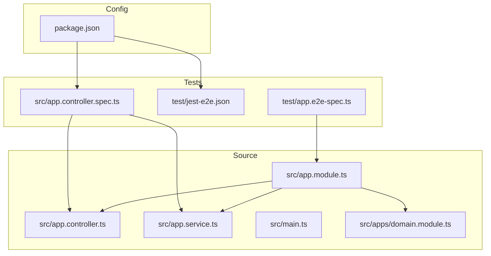
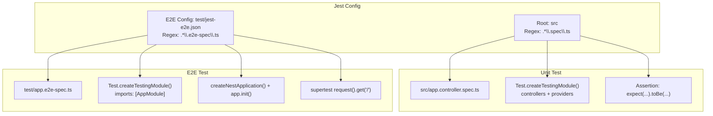
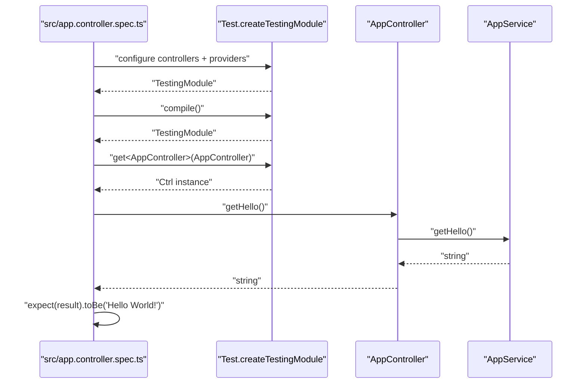
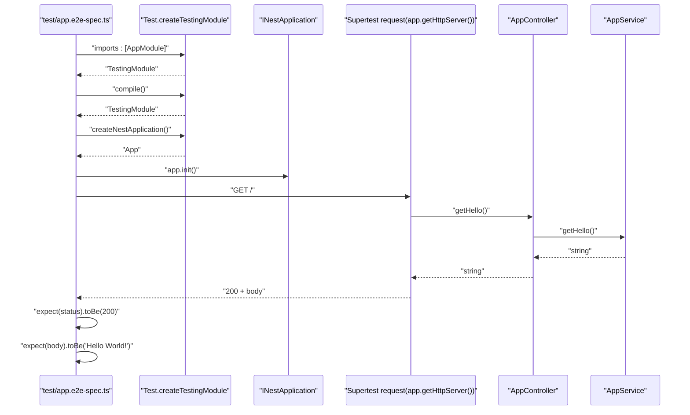
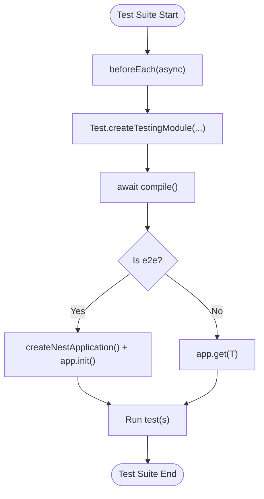
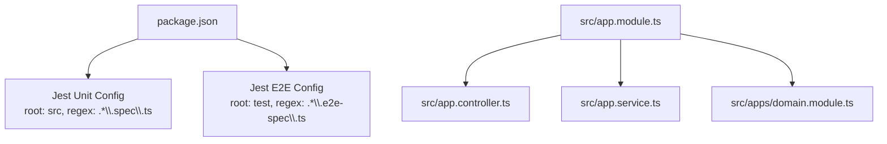

# Testing Strategy

<cite>
**Referenced Files in This Document**
- [app.controller.spec.ts](file://src/app.controller.spec.ts)
- [app.e2e-spec.ts](file://test/app.e2e-spec.ts)
- [jest-e2e.json](file://test/jest-e2e.json)
- [package.json](file://package.json)
- [app.controller.ts](file://src/app.controller.ts)
- [app.service.ts](file://src/app.service.ts)
- [app.module.ts](file://src/app.module.ts)
- [domain.module.ts](file://src/apps/domain.module.ts)
- [main.ts](file://src/main.ts)
</cite>

## Table of Contents
1. [Introduction](#introduction)
2. [Project Structure](#project-structure)
3. [Core Components](#core-components)
4. [Architecture Overview](#architecture-overview)
5. [Detailed Component Analysis](#detailed-component-analysis)
6. [Dependency Analysis](#dependency-analysis)
7. [Performance Considerations](#performance-considerations)
8. [Troubleshooting Guide](#troubleshooting-guide)
9. [Conclusion](#conclusion)
10. [Appendices](#appendices)

## Introduction
This document explains the testing strategy implemented in the easysearch-monolith application. It focuses on how Jest is configured and used alongside @nestjs/testing utilities to provide both unit and end-to-end (e2e) tests. It covers the structure and behavior of the existing tests, the differences between unit and e2e tests, and best practices for maintaining fast, reliable, and maintainable tests in NestJS applications.

## Project Structure
The repository organizes tests under a dedicated test directory and unit tests under src. The configuration separates unit and e2e test environments and transformations.

**Diagram sources**
- [app.module.ts](file://src/app.module.ts#L1-L13)
- [app.controller.ts](file://src/app.controller.ts#L1-L13)
- [app.service.ts](file://src/app.service.ts#L1-L9)
- [domain.module.ts](file://src/apps/domain.module.ts#L1-L11)
- [main.ts](file://src/main.ts#L1-L9)
- [app.e2e-spec.ts](file://test/app.e2e-spec.ts#L1-L26)
- [jest-e2e.json](file://test/jest-e2e.json#L1-L10)
- [app.controller.spec.ts](file://src/app.controller.spec.ts#L1-L23)
- [package.json](file://package.json#L1-L72)

**Section sources**
- [package.json](file://package.json#L1-L72)
- [app.e2e-spec.ts](file://test/app.e2e-spec.ts#L1-L26)
- [app.controller.spec.ts](file://src/app.controller.spec.ts#L1-L23)

## Core Components
- Unit test for AppController validates controller behavior by instantiating a minimal module and asserting the controller’s method result.
- E2e test boots the full application using the real Nest application instance and validates HTTP responses via supertest.

Key characteristics:
- Unit tests use Test.createTestingModule to assemble only the necessary parts (controller and provider).
- E2e tests use the same AppModule to bootstrap the full application stack.

**Section sources**
- [app.controller.spec.ts](file://src/app.controller.spec.ts#L1-L23)
- [app.e2e-spec.ts](file://test/app.e2e-spec.ts#L1-L26)

## Architecture Overview
The testing architecture leverages Jest with ts-jest for TypeScript transformation and @nestjs/testing for NestJS-specific test scaffolding. Unit tests isolate the controller and service, while e2e tests initialize the full application module graph.

**Diagram sources**
- [package.json](file://package.json#L54-L71)
- [jest-e2e.json](file://test/jest-e2e.json#L1-L10)
- [app.controller.spec.ts](file://src/app.controller.spec.ts#L1-L23)
- [app.e2e-spec.ts](file://test/app.e2e-spec.ts#L1-L26)

## Detailed Component Analysis

### Unit Test: AppController Behavior
This unit test demonstrates how to:
- Create a minimal testing module with only the controller and its provider.
- Instantiate the controller from the compiled module.
- Assert the controller’s method returns the expected value.

**Diagram sources**
- [app.controller.spec.ts](file://src/app.controller.spec.ts#L1-L23)
- [app.controller.ts](file://src/app.controller.ts#L1-L13)
- [app.service.ts](file://src/app.service.ts#L1-L9)

**Section sources**
- [app.controller.spec.ts](file://src/app.controller.spec.ts#L1-L23)
- [app.controller.ts](file://src/app.controller.ts#L1-L13)
- [app.service.ts](file://src/app.service.ts#L1-L9)

### End-to-End Test: Full Application Bootstrapping
This e2e test demonstrates how to:
- Bootstrap the full application using the real AppModule.
- Initialize the Nest application instance.
- Issue HTTP requests using supertest against the actual server.
- Assert HTTP status and response body.

**Diagram sources**
- [app.e2e-spec.ts](file://test/app.e2e-spec.ts#L1-L26)
- [app.module.ts](file://src/app.module.ts#L1-L13)
- [app.controller.ts](file://src/app.controller.ts#L1-L13)
- [app.service.ts](file://src/app.service.ts#L1-L9)

**Section sources**
- [app.e2e-spec.ts](file://test/app.e2e-spec.ts#L1-L26)
- [app.module.ts](file://src/app.module.ts#L1-L13)

### Test Setup and Lifecycle Hooks
Both unit and e2e tests rely on the same @nestjs/testing primitives:
- beforeEach to configure and compile a module fixture.
- Using TestingModule to create either a controller instance (unit) or a full Nest application (e2e).
- Proper async handling during compilation and initialization.

**Diagram sources**
- [app.controller.spec.ts](file://src/app.controller.spec.ts#L1-L23)
- [app.e2e-spec.ts](file://test/app.e2e-spec.ts#L1-L26)

**Section sources**
- [app.controller.spec.ts](file://src/app.controller.spec.ts#L1-L23)
- [app.e2e-spec.ts](file://test/app.e2e-spec.ts#L1-L26)

## Dependency Analysis
- Unit tests depend on @nestjs/testing and ts-jest via the Jest configuration in package.json.
- E2e tests depend on @nestjs/testing and supertest, with a separate Jest configuration in test/jest-e2e.json.
- Both share the same source module structure: AppModule imports DomainModule and exposes AppController and AppService.

**Diagram sources**
- [package.json](file://package.json#L54-L71)
- [jest-e2e.json](file://test/jest-e2e.json#L1-L10)
- [app.module.ts](file://src/app.module.ts#L1-L13)
- [domain.module.ts](file://src/apps/domain.module.ts#L1-L11)
- [app.controller.ts](file://src/app.controller.ts#L1-L13)
- [app.service.ts](file://src/app.service.ts#L1-L9)

**Section sources**
- [package.json](file://package.json#L1-L72)
- [jest-e2e.json](file://test/jest-e2e.json#L1-L10)
- [app.module.ts](file://src/app.module.ts#L1-L13)
- [domain.module.ts](file://src/apps/domain.module.ts#L1-L11)

## Performance Considerations
- Prefer unit tests for isolated logic and fast feedback loops.
- Use e2e tests sparingly and only for integration scenarios that require the full application stack.
- Keep e2e tests focused on critical paths and avoid heavy external dependencies.
- Use beforeEach to minimize repeated setup overhead and keep suites independent.

[No sources needed since this section provides general guidance]

## Troubleshooting Guide
Common issues and resolutions:
- Missing or incorrect Jest configuration:
  - Verify unit and e2e configs match the intended file patterns and root directories.
  - Ensure ts-jest transform is present for TypeScript files.
- E2e test failures due to server startup:
  - Confirm app.init() completes before issuing requests.
  - Ensure the port is accessible and not blocked by firewall or process conflicts.
- Assertion mismatches:
  - Compare expected vs actual values carefully; confirm endpoint paths and HTTP methods.
  - For e2e tests, use supertest’s chaining to assert status and body.

**Section sources**
- [package.json](file://package.json#L54-L71)
- [jest-e2e.json](file://test/jest-e2e.json#L1-L10)
- [app.e2e-spec.ts](file://test/app.e2e-spec.ts#L1-L26)

## Conclusion
The easysearch-monolith application employs a clear separation between unit and e2e tests. Unit tests validate controller behavior in isolation using @nestjs/testing, while e2e tests bootstrap the full application and validate HTTP responses. The Jest configuration in package.json and test/jest-e2e.json ensures proper TypeScript transformation and environment selection. Following the best practices outlined here will help maintain fast, reliable, and maintainable tests as the application evolves.

[No sources needed since this section summarizes without analyzing specific files]

## Appendices

### Running Tests
- Unit tests: Use the script defined in package.json to run Jest against unit specs.
- E2e tests: Use the script defined in package.json to run Jest with the e2e configuration.
- Watch mode and coverage are supported via scripts for iterative development.

**Section sources**
- [package.json](file://package.json#L8-L21)

### Difference Between Unit and E2e Tests
- Unit tests:
  - Scope: Small, isolated units (e.g., controller methods).
  - Speed: Fast execution; no HTTP server bootstrapping.
  - Mocking: Easy to inject mocks and stubs for dependencies.
- E2e tests:
  - Scope: Full application stack and HTTP interactions.
  - Speed: Slower due to server initialization and network I/O.
  - Realism: Validates end-to-end behavior with actual routes and middleware.

[No sources needed since this section provides general guidance]

### Test Coverage Goals and Suggestions
- Coverage configuration:
  - The Jest unit config collects coverage from all TypeScript files and outputs to coverage/.
- Recommendations:
  - Add unit tests for new controller methods and service logic.
  - Add e2e tests for critical routes and integration points.
  - Consider boundary and error-case tests for both unit and e2e suites.

**Section sources**
- [package.json](file://package.json#L65-L71)

### Best Practices for Writing Maintainable, Fast, and Reliable Tests in NestJS
- Keep tests focused and deterministic.
- Use beforeEach to set up minimal, reusable fixtures.
- Prefer unit tests for pure logic; reserve e2e tests for HTTP and integration scenarios.
- Avoid global state and ensure teardown/reset between tests.
- Use descriptive test names and group related assertions.

[No sources needed since this section provides general guidance]